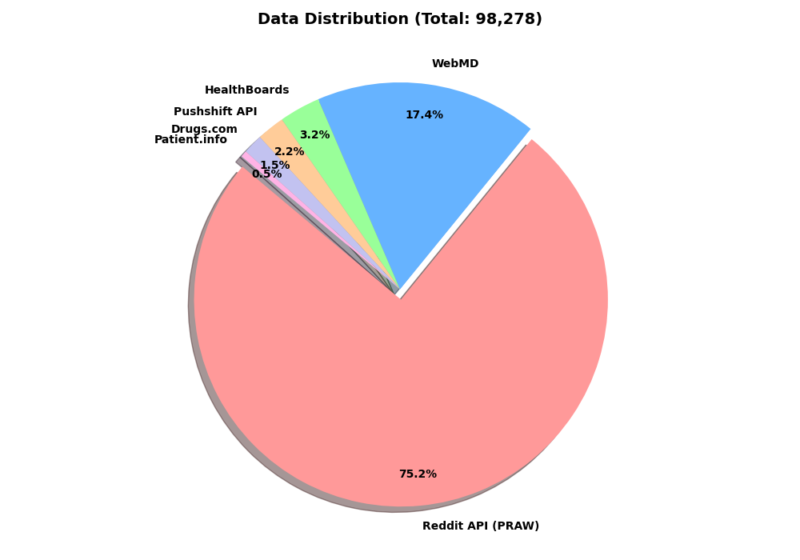
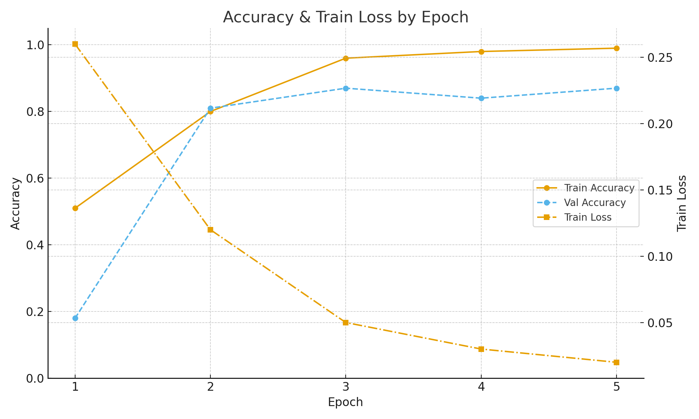
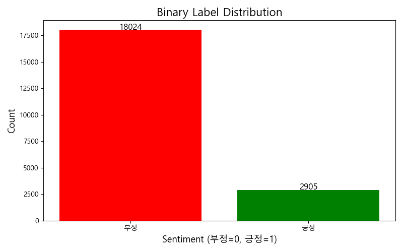

# 🦠 COVID Vaccine Controversy Analysis by BERT/DeBERTa
**온라인 댓글 기반 코로나 백신 여론 분석 프로젝트**

[](https://www.python.org/)
[](https://pytorch.org/)
[](https://huggingface.co/)
[](https://huggingface.co/docs/transformers/index)
[](https://huggingface.co/docs/transformers/model_doc/deberta_v2)
[](https://huggingface.co/monologg/koelectra-base-v3-discriminator)
[](https://maartengr.github.io/BERTopic/)
[](https://hdbscan.readthedocs.io/)
[](https://scikit-learn.org/)
[](https://pandas.pydata.org/)
[](https://numpy.org/)
[](https://matplotlib.org/)
[](https://jupyter.org/)

---

## 1. 연구 개요 (Overview)

### 1.1 왜 “백신 논란”을 댓글로 봤는가?

- **첫번째** 필자는 경험적으로 "백신"을 신뢰한다. 하지만 코로나 팬데믹 기간 중에 *‘백신 부작용’*은 정말 논란의 여지가 많았던 주제였다. 여기서 의문이 들었다.  
  → **“정말 백신에 대한 부정적 경향이 사람들이 부작용을 심각하게 생각해서 그런 것일까?”**
- **두번째** 경험상 코로나 팬데믹 동안 사람들의 감정과 생각은 뉴스 기사 본문이 아니라 **댓글·포럼·SNS**에 훨씬 더 직접적으로 드러난다.
- **세번째** 필자가 제약회사 공정, 시장 분석 분야를 목표로 하는 만큼, **데이터를 이용해 약품에 대한 긍/부정을 연구 주제로 삼는 것**이 매우 흥미로웠기 때문이다.

요약하면,

- 뉴스 기사: “정책이 발표되었다”는 **사실** 중심  
- 온라인 댓글: “그래서 나는 **불안/분노/찬성/냉소**를 느낀다”는 **감정과 해석** 중심

기존 연구들은 주로 **확진자 수, 사망자 수, 금융 지표**처럼  
“숫자로 정리된 지표”와 여론의 상관관계를 다루는 경우가 많다.

하지만 실제 논란의 핵심은 다음과 같은 질문에 가깝다.

> 사람들은 **정확히 무엇 때문에** 화가 났고, 불안했을까?  
> 정말로 백신에 대한 반감은 사람들이 일반적으로 생각하는 **백신 부작용**이 문제였을까?  
> 아니면 **마스크·백신 의무화, 경제적 부담, 정치 갈등**같은 다른 이유가 더 컸을까?

이 프로젝트는 이 질문에 답하기 위해  
**대규모 온라인 댓글 데이터**를 모으고,  
**감성 분석 + 토픽 모델링**으로  
“코로나 백신 논란의 축이 어디에 있었는지”를 추적한다.

---

### 1.2 연구 질문

이 프로젝트는 다음 네 가지 질문에 집중한다.

- **Q1.** 코로나/백신 관련 온라인 댓글의  
  **감성 분포(긍·부정)**는 어떠한가?
- **Q2.** 전체 여론에서 **부정 감성의 비중은 얼마나 높은가?**
- **Q3.** 부정/긍정 댓글은 각각 **어떤 주제(토픽)**를 중심으로 모이는가?
- **Q4.** 논란의 중심축은
  - **부작용·의학적 위험**인가,  
  - 아니면 **다른 무언가가**인가?

---

### 1.3 이 프로젝트가 한 일 (요약)

1. 여러 사이트(포럼·리뷰·Q&A 등)에서  
   **코로나/백신 관련 댓글·리뷰 약 10만 건**을 **키워드 기반**으로 크롤링
2. **다단계 전처리 + 주제 관련성 필터링**을 통해  
   **실제로 코로나/백신 논의에 해당하는 텍스트만 남긴 고순도 데이터셋** 구축
3. 약 **2,200개** 댓글을 사람이 직접 라벨링하여  
   **DeBERTa v3 기반 감성 분류 모델 (Val. Acc ≈ 0.87)** 학습
4. 감성 라벨과 **BERTopic 토픽 모델링**을 결합해  
   “**무슨 이슈가 부정 여론을 끌어올렸는지**”를 분석

---

## 2. 데이터 수집 (Data Collection)

### 2.1 수집 대상 사이트 & 키워드

크롤링은 **“코로나/백신 논의를 실제로 볼 수 있는 공간”**에 집중했다.

| 구분 | 플랫폼/사이트 | 언어 | 주요 수집 대상 | 크롤링 방식 / 키워드 예시 |
|------|---------------|------|----------------|----------------------------|
| 커뮤니티 | Reddit (여러 서브레딧) | 🇺🇸 | 게시글/댓글 | `covid`, `vaccine`, `pfizer`, `moderna`, `jab`, `side effect` 등으로 제목/본문 검색 후 댓글 수집 |
| 헬스 포럼 | WebMD, HealthBoards, Patient.info 등 | 🇺🇸 | 증상/부작용 관련 게시글·댓글 | `vaccine`, `shot`, `reaction`, `booster`, `symptoms` 등 키워드 기반 포럼 글/댓글 수집 |
| 약 리뷰 | Drugs.com 등 | 🇺🇸 | 백신·약물 리뷰 | 약 이름 + `covid`, `vaccine` 등 조합으로 리뷰 검색 |
| 국내 Q&A/커뮤니티(실험) | Naver 지식iN, DC Inside 등 | 🇰🇷 | 관련 질문/게시글 | `백신`, `코로나`, `부작용`, `타이레놀` 등으로 크롤링 시도 (최종 분석에서는 대부분 제외) |

- Reddit + WebMD + Pushshift + HealthBoards + Patient.info + Drugs.com 통합
- 최종 영어 데이터: **98,278건**

> 최종 분석은 **언어적 일관성**을 위해  
> **영어 텍스트 중심 데이터셋**을 사용했다. (언어 혼재 문제)


### 2.2 데이터 출처 비율 (Source Distribution)

본 연구에서 사용한 **수량 보정 기준 데이터셋**은 총 **98,278건**으로,  
각 사이트/플랫폼별 문서 수와 비율은 다음과 같다.

| 출처 (Source)          |  건수 (최종)       | 비율 (Percentage) |
|------------------------|-------------------:|------------------:|
| Reddit API (PRAW)      | 73,934             | 75.23%            |
| WebMD                  | 17,055             | 17.35%            |
| HealthBoards           | 3,147              | 3.20%             |
| Pushshift API (Reddit) | 2,132              | 2.17%             |
| Drugs.com              | 1,523              | 1.55%             |
| Patient.info           | 487                | 0.50%             |
| **합계 (Total)**       | **98,278**         | **100.00%**       |


- Reddit 계열 데이터(PRAW + Pushshift)가 전체의 **약 75.23%**를 차지해  
  영어권 커뮤니티 중심의 논의를 반영하고,
- WebMD, HealthBoards, Patient.info, Drugs.com 등 **헬스 포럼·약 리뷰 사이트 데이터**가  
  나머지 약 24.77%를 구성하여, **임상 경험·부작용 후기** 관점을 보완한다.




---


### 2.3 크롤링 기간 (Crawling Window)

모든 원천(커뮤니티·헬스 포럼·약 리뷰 사이트 등)에서 수집한 데이터를 하나로 합친 뒤,  
`created_at` 시계열을 기준으로 실제 포함된 댓글/리뷰의 기간을 확인했다.

- **최종 통합 데이터셋(`Real_Final.csv`) 기준 시점 범위**
  - **가장 이른 시점:** 2019-04-04  
  - **가장 늦은 시점:** 2025-10-21  

즉, 본 연구는

- 코로나 팬데믹 직전(2019년 초반)부터  
- 팬데믹 확산기, 백신 접종·의무화 논쟁기,  
- 그리고 이후 백신/정책에 대한 후속 논의를 포함하는 **2019-04-04 ~ 2025-10-21** 사이의 온라인 댓글을 다룬다.

원본 사이트의 타임스탬프는 UTC 기준으로 수집되었으며,  
분석 단계에서는 이를 `created_at`(datetime) 컬럼으로 통일해 시계열 분석에 활용했다.
  
---

### 2.4 Reddit 크롤링 전략 (서브레딧 & 댓글 트리)

Reddit는 **게시글–상위 댓글–대댓글**로 이어지는 트리 구조를 가지므로,  
“어디까지를 하나의 여론 단위로 볼 것인가?”가 중요하다.  
본 프로젝트에서는 다음과 같은 전략을 사용했다.

#### 2.4.1 타깃 서브레딧 선정

코로나/백신 관련 논의가 활발한 서브레딧을 **사전에 리스트업**한 뒤,  
각 서브레딧별로 데이터를 수집했다.

- 예시 타깃 서브레딧:
  - `r/Coronavirus`
  - `r/COVID19`
  - `r/CoronavirusUS`
  - `r/CoronavirusVaccine`
  - `r/antiVaccine`
  - (기타 코로나/백신 관련 서브레딧 다수)

> 전역 키워드 검색보다는,  
> **코로나/백신 전용 서브레딧 자체**를 타깃으로 삼아,  
> 그 안에서 인기 글(top posts) 중심으로 댓글을 수집하는 전략을 사용했다.

#### 2.5.1 게시글 선택 기준 (Top Posts 중심)

PRAW 기반 Reddit 클라이언트에서 각 서브레딧에 대해:

- `subreddit.top(time_filter="all", limit=POST_LIMIT)`  
  를 사용해, 서브레딧 개설 이후 **역사적으로 가장 많이 읽히고 추천된 게시글**들을 가져왔다.
- `time_filter="all"` 옵션을 사용했기 때문에,
  - 특정 연·월로 기간을 제한하지 않고,
  - **팬데믹 전후 전체 기간에서 “이슈를 대표하는 상위 글”**들을 대상으로 삼았다.

이렇게 선택된 각 게시글(`submission`)에 대해, 댓글을 별도로 수집했다.

#### 2.5.2 댓글 수집 기준 – **전체 댓글 트리 수집**

Reddit의 댓글 구조는

> 게시글 → 상위(top-level) 댓글 → 대댓글(reply) → … (트리 구조)

이지만, 실제 구현에서는 **상위 댓글만이 아니라 전체 댓글 트리**를 모두 펼쳐서 수집했다.

구체적인 로직은 다음과 같다.

- 각 `submission`에 대해:
  - `submission.comments.replace_more(limit=None)`  
    → “MoreComments …” 노드를 모두 풀어서 **숨겨진 대댓글까지 전부 펼침**
  - `submission.comments.list()`  
    → 트리 구조를 평탄화(flatten)해서 **모든 댓글을 1차원 리스트로 순회**

- 각 댓글에서 추출한 주요 필드:
  - `body` : 댓글 본문 텍스트
  - `created_utc` : 작성 시각(UTC 타임스탬프, 이후 `created_at`으로 변환)
  - `score` : 추천 수
  - `subreddit` : 서브레딧 이름
  - `post_id` / `comment_id` / `parent_id` : 스레드 구조 복원에 필요한 메타데이터

- 크롤링 단계에서 적용한 **최소 필터링**:
  - `body`가 `"[deleted]"`, `"[removed]"` 인 댓글 제거
  - 공백 제거 후 길이가 너무 짧은 텍스트(예: 20자 미만)는 바로 제외  
    → “lol”, “ok”, 이모티콘 한 줄 등, **실질적인 의견·감정이 없는 잡담**을 초기 단계에서 제거

> 요약하면, Reddit의 경우  
> **“코로나/백신 관련 서브레딧에서 역사적으로 이슈가 되었던 상위 게시글들”**을 기준으로 삼고,  
> 각 게시글에 달린 **전체 댓글 트리(상위 + 대댓글)를 모두 수집**한 뒤,  
> `[deleted]/[removed]` 및 너무 짧은 잡담을 제거한 댓글만  
> 이후 전처리·키워드 필터링 단계로 넘기는 구조이다.

---

### 2.6 Reddit 데이터가 전체에서 차지하는 비율

위 2.4의 플랫폼 비율 표와 연결해서,  
**최종 20,929건 중 Reddit 데이터가 차지하는 비중**을 한 번 더 정리했다.

- 최종 데이터 수: **20,929건**
- 이 중 Reddit에서 온 텍스트: **`N_Reddit`건 (전체의 `P_Reddit %`)**

→ 즉, **온라인 백신 논쟁을 대표하는 주요 데이터 소스가 Reddit**이며,  
헬스 포럼/약 리뷰 사이트 데이터는  
**“실제 증상·부작용 경험”을 보완하는 보조 소스** 역할을 한다고 볼 수 있다.

---

### 2.7 원시 댓글 데이터 예시 (Raw Samples)

백신/코로나 관련 댓글이 실제로 어떤 형태인지 보여주기 위해,  
각 플랫폼에서 가져온 **실제 원시 텍스트 일부**를 예시로 제시한다.

> ⚠️ 개인정보 및 아이디는 모두 제거/마스킹했다.  
> URL, 계정명, 구체적인 병원/지역 이름 등은 `[...]` 처리했다.

| source        | created_at        | text (원문 일부) |
|---------------|-------------------|------------------|
| `Reddit`      | 2021-01-15 13:24  | "I got my second Pfizer shot yesterday and my arm hurts like hell, but honestly it's nothing compared to getting covid. My parents are getting theirs next week..." |
| `WebMD`       | 2021-03-02 08:11  | "After the Moderna vaccine I had chills and a fever for one night. I was scared because of all the news, but my doctor said it was a normal immune response..." |
| `HealthBoards`| 2020-11-28 21:03  | "My mom is in the hospital and they're talking about this new vaccine. I'm worried about long term side effects, but also about her catching covid while waiting..." |
| `Drugs.com`   | 2021-05-07 17:40  | "Vaccine: [brand]. Age: 35. Side effects: sore arm, mild headache, fatigue for 2 days. Would still recommend, it's better than the risks of covid." |


## 3. 방법론 요약 (Methods)

### 3.1 전처리 파이프라인

전처리는 크게 네 단계로 구성된다.

1. **구조적 노이즈 제거**
   - `[deleted]`, `[No Content]` 등 삭제된 게시물 제거  
   - `lol`, `ok`처럼 **20자 미만**, **5단어 미만**의 의미 없는 짧은 문장 삭제

2. **언어 필터링**
   - 비영어 문자 비율이 **일정 기준 이상**인 문장 제거  
   - 영어 기반 사전학습 모델 사용을 고려한 일관성 확보

3. **형식적 노이즈 제거**
   - URL, 특수문자, 이모티콘 등 제거
   - 불용어(stopwords) 제거  
     (너무 일반적인 단어 + 전처리 후에도 의미를 흐리는 잔여 단어)

4. **주제 관련성 필터링 (Keyword-based Relevance)**
   - 아래와 같은 코로나/백신 핵심 키워드 중  
     **하나도 포함되지 않은 문장은 “주제 무관”으로 제거**

   ```python
   KEYWORDS = [
       'vaccine', 'covid', 'coronavirus', 'side effect', 'adverse', 'pfizer', 'moderna',
       'booster', 'jab', 'shot', 'vax', 'myocarditis', 'astrazeneca', 'janssen',
       'symptoms', 'mandate', 'mask', 'masked', 'unvaccinated', 'vaxxed', 'unvaxxed',
       'hospital', 'death', 'long covid', 'long-covid', 'spike protein', 'mrna'
   ]

 → 전처리의 핵심은 **“양을 줄이더라도, 코로나/백신 논쟁에 실제로 해당하는 문장만 남기자”**는 원칙이다.

---

#### 3.1.X 전처리 단계별 실제 예시

아래는 Reddit에서 가져온 실제 댓글 한 문장이  
전처리 단계(A→B→C)를 거치며 어떻게 정제되는지 보여주는 예시이다.

| 단계 | 내용 |
|------|------|
| Raw 원문 | "Here's the link to the article about covid vaccines: https://[...] Honestly I'm scared of the side effects, but also I don't want my dad to end up in the hospital again." |
| A. 최소 전처리 | "heres the link to the article about covid vaccines https honestly im scared of the side effects but also i dont want my dad to end up in the hospital again" |
| B. 특수문자/URL/불용어 제거 | "link article covid vaccines honestly scared side effects dont want dad end hospital" |
| C. 키워드 기반 관련성 필터 통과 여부 | ✅ `covid`, `vaccines`, `side effects`, `hospital` 포함 → **주제 관련 (True)** 으로 유지 |

> 이처럼 전처리에서는  
> - **형식적 노이즈 제거(A,B)**와  
> - **코로나/백신 관련 여부 필터링(C)**  
> 을 동시에 수행해, “깨끗하면서도 주제에 맞는 텍스트”만 남기도록 했다.


### 3.1.1 전처리 버전 비교 (요약)

실제 구현 과정에서는 아래와 같이 여러 버전을 거쳐 강화되었다.

#### 버전 A – 최소 전처리

- 특수문자 제거 + 소문자 변환 정도만 수행
- LDA 상위 키워드에 `http`, `www`, `com`, `trump`, `biden`, `news` 등  
  링크/정치인/사이트 이름이 과도하게 등장  
  → **“이 정도로는 ‘백신 논란의 구조’를 보기 어렵다”**는 결론

#### 버전 B – 특수문자/URL/불용어 제거

- URL·이모티콘·특수문자 제거 + 일반 불용어 제거
- 슬슬 `mask`, `vaccine`, `company`, `money`, `hospital` 등 의미 있는 단어가 LDA 토픽에 등장하기 시작
- 하지만 여전히 코로나/백신과 **직접 관련 없는 잡담**이 다수 포함  
  → **주제 관련성 필터링 단계 추가 필요**

#### 버전 C – 키워드 기반 주제 관련성 필터링

- 코로나/백신 이슈에서 실제로 자주 등장하는 키워드 리스트 구축
- 문장 내에 이 키워드가 **하나도 없으면 “주제 무관(False)”로 제거**

**결과:**

- ✅ True (관련 있음): **23,939건**  
- ❌ False (관련 없음): **75,338건** (분석 제외)

True 데이터 10%를 직접 검토한 결과,

- 대부분 실제로 코로나/백신 논의
- 단, 링크 공유·정보 전달 위주로 감정이 거의 없는 문장은 추가로 삭제

→ 최종 파이프라인은 이 **버전 C**를 기반으로 구축되었으며,  
전처리의 목적은 **“텍스트를 깨끗하게 만드는 것 + 주제와 무관한 문장을 제거하는 것”**  
두 축을 동시에 만족하는 것이었다.

---

### 3.1.2 전처리 단계별 데이터 수 변화

| 단계 | 설명 | 남은 데이터 수(건) |
|------|------|--------------------|
| **0. Raw merged** | 여러 사이트에서 크롤링한 뒤, 기본적인 형식 통일만 수행한 상태 | **약 98,278** |
| **1. 구조적 노이즈 제거** | `[deleted]`, 너무 짧은 잡담(lol, ok 등), 내용 없는 문장 제거 | 약 90,000 내외 |
| **2. 언어 필터링** | 비영어 텍스트 제거 (비영어 비율이 높은 문장 필터링) | **약 82,000** |
| **3. 주제 관련성 필터링** | 코로나/백신 관련 키워드가 **하나도 없는 문장 제거** | ✅ 관련 있음: **23,939**<br>❌ 관련 없음: 75,338 (제외) |
| **4. 링크·정보공유 위주 문장 제거** | 기사/논문 링크만 공유하거나, 의견/감정이 거의 없는 문장 추가 삭제 | **약 23,352** |
| **5. 모델 학습/분석용 최종본** | 날짜/텍스트/사이트 정보가 완비되고, 전처리가 완전히 끝난 데이터 | **20,929**  |

> **108k → 20,929건**으로 줄어드는 과정에서  
> **“주제와 감정을 갖고 있는 문장”만 최대한 남기도록 설계**했다.  
> 숫자를 줄이는 것이 목표가 아니라,  
> “코로나/백신 논쟁”과 **무관한 잡음을 제거하는 것**이 목표였다.

---


### 3.2 수동 라벨링 데이터

- 전체 데이터 중 **약 10% (2,200~2,300개)**를 무작위로 샘플링
- 사람(연구자)이 직접 **두 가지 라벨**을 동시에 부여
  - Binary: `0 = 부정`, `1 = 긍정`
  - Three-Class: `0 = 부정`, `1 = 중립`, `2 = 긍정`
- 이후 성능·안정성을 고려해  
  최종 파이프라인은 **Binary 분류(부정 vs 긍정)**에 집중

#### 3.2.X 수동 라벨 예시 (실제 문장 5개, Binary)

아래는 사람이 직접 라벨링한 댓글 예시 5개이다.  
(텍스트는 개인정보·URL 등을 일부 마스킹했다.)

| id  | text (일부) | Binary 라벨 |
|-----|-------------|-------------|
| ex1 | "The vaccine saved my parents. They both caught covid before and this time it was just like a mild cold." | 1 (긍정) |
| ex2 | "I'm not anti-vax but the mandate at my job is ridiculous. People are getting fired over this." | 0 (부정) |
| ex3 | "Had fever and chills for one night after Moderna, totally worth it if it keeps me out of ICU." | 1 (긍정) |
| ex4 | "My friend developed heart issues after the shot, doctors keep saying it's unrelated but I'm not convinced." | 0 (부정) |
| ex5 | "Got the vaccine yesterday." → 감정이 거의 드러나지 않아 최종 라벨링 세트에서는 제외 | (라벨링 제외) |

> 이 표는 **라벨 기준이 실제로 어떻게 적용되었는지**를 보여주기 위한 예시이며,  
> 감정이 거의 드러나지 않는 문장이나 애매한 문장은 과감히 **“라벨링 제외”**로 처리해 노이즈를 줄였다.


### 3.2.2 감성 분석 모델 (Sentiment Classification)

**모델 후보**

- KoELECTRA (한국어, 실험용)
- BERT 계열 (영어, baseline)
- DeBERTa v3 (영어, 최종 선택)

**최종 설정 (요약)**

- **모델:** DeBERTa v3 기반 Binary 분류  
- **학습 데이터:** 약 2,200개 수동 라벨링 데이터  
- **손실 함수:** CrossEntropy + 클래스 불균형 대응 (class weight 등)  
- **결과:** Validation Accuracy ≈ **0.86 ~ 0.87**

  #### 3.2.3 최종 학습 스냅샷 

Epoch별 대표 로그는 다음과 같다.

| Epoch | Train Loss | Train Acc | Val Acc |
|-------|-----------:|----------:|--------:|
| 1     | 0.26       | 0.51      | 0.18    |
| 2     | 0.12       | 0.80      | 0.81    |
| 3     | 0.05       | 0.96      | 0.87    |
| 4     | 0.03       | 0.98      | 0.84    |
| 5     | 0.02       | 0.99      | 0.87    |



- Early Stopping 관점에서 **Epoch 3~5 구간이 최적**으로 판단되었다.
- 최종적으로 **Validation Accuracy 약 0.87** 수준의 **DeBERTa 모델**을 채택하였다.

KoELECTRA/Three-Class 등 다양한 시도는  
**부록(시행착오 요약)**에 정리했다.

---

### 3.3 토픽 모델링 (Topic Modeling)

- **1차:** LDA (Latent Dirichlet Allocation)
  - 전처리 문제와 주요 주제 축(경제·정치·마스크·의료비 등) 파악
- **최종:** BERTopic + HDBSCAN
  - 고차원 임베딩 + 밀도 기반 클러스터링
  - 노이즈 문서(`Topic = -1`) 자동 분리
  - 사람이 읽고 해석 가능한 토픽 이름 수동 부여

감성 라벨(부정/긍정)과 토픽을 결합해

> **“어떤 이슈가 어떤 감성에 연결되는지”**를 보는 것이 핵심이다.

---

## 4. 주요 결과 (Results)

### 4.1 감성 분포

최종 데이터(20,929건)에 대해  
DeBERTa v3 Binary 모델이 예측한 결과:

| 감성              | 개수   | 비율    |
|-------------------|-------:|--------:|
| 부정 (Negative)   | 18,024 | 약 86%  |
| 긍정 (Positive)   | 2,905  | 약 14%  |

→ 코로나/백신 관련 온라인 댓글은  
전반적으로 **부정 여론이 절대적으로 우세한 구조**를 보인다.




---

### 4.2 부정 토픽 요약

부정으로 분류된 댓글(18,024건) 중  
BERTopic으로 뽑은 **대표 토픽 축(요약)**은 다음과 같다.

| 축 | 대표 내용 (요약) | 예시 키워드 |
|---|------------------|-------------|
| **의료비·의료 시스템 불만** | 병원비, 빚, 의료 접근성, 간호 인력 부족 등 | hospitals, debt, pay, healthcare, nurses |
| **마스크·백신 의무화 갈등** | 상점/직장에서의 마스크와 백신 착용 강제, 고객–직원 갈등 | walmart, store, customers, masks, enforce |
| **정치·책임 공방** | 트럼프, 정부, 누구 책임인가에 대한 논쟁 | trump, president, responsible, politics |
| **백신 부작용·장기 후유증 걱정** | 접종 후 증상, 사망·장기 코로나에 대한 두려움 | effects, infection, long, died, side |
| **아동·취약계층 걱정** | 아이 접종, 소아과, 기저질환자 마스크 착용 문제 | kids, children, parents, asthma, breathing |
| **음모론·hoax 프레이밍** | “covid는 사기다”, “propaganda다”라는 담론 | hoax, propaganda, fake, deny |

**핵심 포인트**

- “백신 부작용”만이 아니라,
- **의료비·병원 시스템**,  
- **마스크/백신 의무화**,  
- **정치적 갈등**,  
- **음모론 프레이밍**이 모두 뒤섞여 **부정 여론을 형성**하고 있다.

---

#### 4.2.1 토픽별 실제 문장 예시

각 토픽이 어떤 식의 문장으로 구성되는지 보여주기 위해,  
토픽별 실제 댓글 예시를 일부 제시한다. (익명/마스킹 처리)

**[토픽: 의료비·의료 시스템 불만]**

> "I avoided going to the hospital when I had covid symptoms because I simply can't afford another bill. The vaccine side effects scare me less than the debt."

**[토픽: 마스크·백신 의무화 갈등]**

> "My store is still forcing masks even after the mandate ended. Customers yell at us, management doesn't care, it's a nightmare."

**[토픽: 음모론·hoax 프레이밍]**

> "Covid is just a hoax to control people, the so-called vaccine is part of the same propaganda machine."

**[토픽: mRNA 백신 옹호·효과]**

> "mRNA vaccines are one of the best things modern medicine has done. My whole family got vaccinated and no one ended up in the hospital this time."


### 4.3 긍정 토픽 요약

긍정 댓글(2,905건)에서 나타난 주요 토픽 축은 다음과 같다.

| 축 | 대표 내용 (요약) | 예시 키워드 |
|---|------------------|-------------|
| **mRNA 백신 옹호·효과** | 효과를 경험했다, 면역이 생겼다 등 | vaccine, vaccinated, mrna, immune |
| **경미한 부작용 경험 공유** | 팔이 아팠지만 괜찮았다, 부작용이 생각보다 약했다 | pfizer, moderna, side, second, dose |
| **의료진·병원의 역할 인정** | 의료진의 희생과 시스템 유지에 대한 감사 | hospital, patients, care, nurses |
| **마스크/규정 준수 긍정** | 마스크 착용이 타인을 보호한다는 인식 | wear, mask, protect, medical |

→ 같은 “병원/마스크/백신”이라도  
어떤 사람에게는 **부정(비용·강제성)**,  
어떤 사람에게는 **긍정(보호·안전)**으로 받아들여진다는 **여론의 양면성**이 뚜렷하게 드러난다.

---

### 4.4 “논란의 축”에 대한 정리

토픽 결과를 감성과 함께 요약하면:

- **초기에는** 백신 자체의 **효능·부작용**이 중요한 이슈였지만,
- **시간이 갈수록**
  - 마스크/백신 **의무화**,
  - 직장·상점에서의 **규정 적용 방식**,
  - **정치적 책임 공방**,
  - **의료비·병원 시스템에 대한 불만**  
  같은 정책·제도·경제·정치 이슈가  
  **부정 여론의 중심축**으로 점점 더 부상한다.

즉,

> 논란의 핵심은 단순한  
> “백신이 위험하냐, 아니냐”를 넘어서  
> **“누가 무엇을 강제하고, 그 비용과 책임을 누가 지는가”**에  
> 더 가까운 문제로 이동한다.

---

## 5. 논의 (Discussion)

### 5.1 공중보건 커뮤니케이션 관점

이 분석은 부정 감성이  
**“부작용 자체”보다 “정책·의무화·경제·정치 갈등”**에 더 민감하다는 점을 시사한다.

향후 팬데믹 대응에서

- “백신은 안전하다”는 메시지 **하나만으로는 부족**하며,
- 동시에 다음 내용을 함께 설명하는 전략이 필요하다.

1. **정책의 공정성**
   - 누구에게 어떤 기준으로 적용되는지
2. **강제성의 한계와 예외 규정**
   - 건강상 사유, 직업적 특성 등에 따른 예외
3. **보상 구조**
   - 부작용 발생 시 지원, 생계 보장 등
4. **정책 결정 과정의 투명성**
   - 어떤 데이터와 전문가 의견을 바탕으로 결정했는지

---

### 5.2 의료 정책·의료기관 관점

부정 토픽에서 지속적으로 등장한 키워드:

- 병원(**hospital**)
- 빚(**debt**), 비용(**pay**)
- 간호 인력 부족(**nurses**)

→ 백신 논란은 단순히  
“맞을까, 말까”를 넘어서

> **“이 시스템 안에서 아프면 나는 얼마나 빚을 지게 되는가?”**

라는 질문과 결합되어 있음.

정책적으로는

- **무료 접종**
- **보험 적용 범위**
- **의료비 지원**
- **상담 창구 안내**

같은 정보를 **적극적으로 알리는 것 자체**가  
부정 여론 완화에 중요할 수 있다.

---

### 5.3 정보 플랫폼·언론·팩트체크 관점

부정 토픽 중 **“covid hoax / propaganda / 음모론”** 토픽은  
상당히 또렷한 클러스터로 분리되었다.

이를 활용하면:

1. 특정 키워드/프레이밍  
   (예: `hoax`, `fake`, `plandemic` 등)의  
   등장 빈도와 맥락을 **상시 모니터링**하고,
2. 해당 프레이밍이 급증하는 시점에
   - **팩트체크 콘텐츠 노출 강화**
   - **공신력 있는 설명글 상단 고정**
   - **추천 알고리즘 조정**

같은 **조기 개입 전략**을 설계할 수 있다.

---

## 6. 한계 및 향후 과제

### 6.1 한계

1. **모델 성능의 한계**
   - Validation Accuracy ≈ **0.87** 수준으로 나쁘진 않지만,
   - 라벨링 오차, 미세한 뉘앙스 오분류 가능성 존재

2. **데이터 편향**
   - Reddit/영어권 포럼 비중이 높아  
     특정 국가·문화·정치 환경에 치우친 여론을 반영

3. **중립 감성 구분의 어려움**
   - Three-Class 모델에서는 **중립 클래스 분리**가 매우 어려웠고,
   - 최종적으로 **Binary 분류**에 집중하게 됨

---

### 6.2 향후 과제

1. **모델 고도화**
   - RoBERTa, GPT 계열 등 다른 아키텍처와 비교
   - 감성 + 토픽/속성 동시 예측하는 **Multi-task 학습** 시도

2. **Relevance 필터 자동화**
   - 키워드 기반 필터 대신  
     별도의 **주제 관련성 분류기(ML 모델)** 도입

3. **다국어·다지역 확장**
   - 한국/유럽/기타 지역 포럼을 추가해  
     국가별 백신 논란 패턴 비교

4. **실시간 대시보드화**
   - 감성·토픽 흐름을 실시간으로 시각화하는  
     **온라인 여론 모니터링 시스템**으로 확장


   ## 📂 데이터 / 폴더 구조 (Data & Folder Layout)


```text
data/
├─ raw/                     # 크롤링 직후 또는 최소 전처리 상태의 원본 데이터
│   ├─ FINAL_DATA_CLEANED_READY.csv
│   ├─ FEAR_raw.csv / FEAR_source.csv   # (옵션) 공포지수 원본
│   └─ ... (개별 사이트별 원본 CSV들)
│
├─ interim/                 # 중간 전처리/필터링 결과
│   ├─ FINAL_DATA_FILTERED_#TRUE.csv
│   │   # is_related_topic = True 인 코로나/백신 관련 텍스트만 남긴 버전
│   ├─ FINAL_DATA_FILTERED_#FALSE.csv
│   │   # 관련성이 낮아 제거된 텍스트 (분석에는 사용 X, 검증용으로 보관)
│   ├─ FINAL_DATA_ROWS_#DELETED.csv
│   │   # 링크 공유 위주·의견/감정이 거의 없는 중립 문장 추가 삭제본
│   └─ ... (필요한 중간 버전들)
│
├─ processed/               # 분석/모델 학습에 사용되는 최종본
│   ├─ DDDD.csv
│   │   # 최종 분석용 메인 데이터셋
│   │   # (정제 완료 텍스트 + 날짜 + 사이트 정보 + 모델 예측 감성 등)
│   ├─ labeled_output#.csv
│   │   # 전체 데이터의 약 10% 샘플에 대해
│   │   # 사람이 직접 Binary/Three-Class 감성 라벨을 붙인 결과
│   ├─ 10_per#_final.csv
│   │   # 수동 라벨링 정제본 (학습/검증에 실제 사용한 버전)
│   └─ ... (토픽모델링/시계열용으로 가공된 추가 CSV가 있다면 여기에)
│
└─ external/                # 외부 지표/보조 데이터
    ├─ FEAR#.csv
    │   # 공포·탐욕 지수(Fear-Greed Index) 시계열
    │   # 날짜(date) 기준으로 DDDD.csv의 부정 비율과 merge해서 사용
    └─ ... (향후 추가할 다른 외부 지표들)
```


---

## 주요 CSV 파일 설명

| 파일명 | 역할/내용 |
| --- | --- |
| `FINAL_DATA_CLEANED_READY.csv` | 여러 소스에서 크롤링한 원본 데이터를 기본적인 정제(삭제된 글, 너무 짧은 글, 비영어 등)까지 마친 통합본 |
| `FINAL_DATA_FILTERED_#TRUE.csv` | 위 통합본에서 코로나/백신 관련 키워드가 포함된 행만 남긴 버전. True/False 중, 분석에 사용하는 “관련 있음” 데이터 |
| `FINAL_DATA_ROWS_#DELETED.csv` | TRUE 데이터 중에서도 링크만 공유하거나 의견/감정이 거의 없는 문장을 추가로 제거한 버전 |
| `FEAR#.csv` | 외부에서 가져온 공포·탐욕 지수(Fear-Greed Index) 시계열 데이터. 날짜 기준으로 부정 비율 시계열과 합쳐 상관/DTW 분석에 사용 |
| `DDDD.csv` | 최종 분석용 메인 데이터셋. 전처리 + 주제 필터링 + 링크/중립 삭제까지 거친 후, DeBERTa Binary 모델의 감성 라벨이 부여된 상태의 데이터 |
| `labeled_output#.csv`, `10_per#_final.csv` | 전체 데이터 중 약 10%를 샘플링해 사람이 직접 부정/중립/긍정 라벨을 붙인 결과. 모델 학습/검증에 사용되는 골드 레이블 세트 |


## 8. 부록 (Appendix – 시행착오 & 중간 결과 정리)

본문에서는 전체 스토리 흐름과 최종 파이프라인에 집중하고,  
이 부록에서는 **시행착오 과정에서 얻은 중간 결과와 교훈**만 정리한다.

---

### 8.1 KoELECTRA & Three-Class 실험 상세

#### 8.1.1 초기 라벨링 기준 & 분포

정제된 데이터 중 약 **10% (2,200~2,300개)**를 샘플링하여  
다음 두 가지 라벨을 동시에 부여했다.

- **Binary**
  - `0 = 부정`, `1 = 긍정`
- **Three-Class**
  - `0 = 부정`, `1 = 중립`, `2 = 긍정`

라벨 분포는 대략 다음과 같았다.

- **Binary**
  - 부정: **약 81.2%**
  - 긍정: **약 18.8%**

- **Three-Class**
  - 부정: **약 63.5%**
  - 중립: **약 17.6%**
  - 긍정: **약 18.9%**

→ 이미 **라벨링 단계에서 부정이 압도적으로 많고, 중립이 상대적으로 적은 구조**라는 점을 확인했다.

---

#### 8.1.2 KoELECTRA 기반 Three-Class 성능

초기에는 한국어 데이터까지 고려하여 **KoELECTRA**를 이용해  
Binary / Three-Class 실험을 모두 진행했다.

- **Binary 실험**
  - Validation Accuracy: **약 0.81 ~ 0.82**

- **Three-Class 실험**
  - Validation Accuracy: **약 0.63** 수준
  - Macro-F1: 대략 **0.2 ~ 0.3** 수준에 머무름
  - 특히 **중립(1) 클래스의 Recall/F1-score가 거의 0에 가까움**

Confusion Matrix 관찰 결과:

- 실제 중립/긍정 문장을 **부정(0)**으로 예측하는 비율이 높고,
- 모델이 사실상 **“부정 vs 나머지”** 구조로 수렴하는 경향이 있었다.

여러 조합을 시도했지만,

- Epoch 수 조절  
- 학습률(LR) 변경  
- Dropout 조정  
- Class Weight, Oversampling, Focal Loss 결합  

등을 적용해도 **Three-Class에서 중립 클래스만큼은 끝까지 안정적으로 분리되지 않는 문제**가 남았다.

---

#### 8.1.3 라벨링 기준 재정의 & 교훈

이 문제를 해결하기 위해:

1. **라벨링 기준을 더 명확하게 재정의**하고,
2. 애매한 문장(사실 전달 + 미묘한 감정)을 다시 읽으면서  
   - 중립 ↔ 부정  
   - 중립 ↔ 긍정  
   경계에 있는 샘플을 재라벨링했다.
3. **감정 표현이 거의 없는 문장**은 라벨링 대상에서 제외하여  
   **라벨 노이즈를 줄이는 쪽으로 정리**했다.

그럼에도 불구하고, 전체 데이터 구조 자체가:

- **부정이 매우 많은 불균형 데이터**,  
- 중립에 대한 **일관된 기준 잡기가 어려운 문제**

를 가지고 있었기 때문에,

> “이 데이터셋에서는 3-Class보다는  
> **Binary(부정 vs 긍정)**에 집중하는 것이 더 타당하다”

는 결론에 도달했고,  
최종 파이프라인을 **Binary DeBERTa v3 모델 중심**으로 설계하게 되었다.

---

### 8.2 불균형 해결 전략 – 시도와 중간 결과

데이터 자체가 **부정 ≈ 80% 이상**인 구조라,  
불균형을 줄이기 위한 여러 전략을 실험했다.

#### 8.2.1 Oversampling (소수 클래스 복제)

- **방법**
  - 긍정/중립 데이터(소수 클래스)를 **중복 샘플링**하여  
    학습 데이터에서의 클래스 비율을 완화

- **관찰**
  - 초기 Epoch에서는 **F1-score가 소폭 좋아지는 경향**
  - 하지만 Epoch를 늘리면
    - 소수 클래스 샘플 일부에 **과적합(overfitting)** 되는 패턴
    - Validation Loss가 오히려 출렁이면서 **불안정해지는 구간**도 관찰

→ **결론**

- **“완전 균형”을 맞출 정도의 강한 oversampling**은 적합하지 않았고,
- 이후에는 **“부분적인 완화” 수준**으로만 사용하거나  
  다른 기법(Class Weight 등)과 **조합**하여 사용.

---

#### 8.2.2 Class Weight (가중치 기반 손실 조정)

- **방법**
  - `CrossEntropyLoss(weight=class_weights)` 형태로,  
    클래스별 **샘플 수의 역수** 등에 비례한 가중치를 부여

- **예시 (Three-Class 기준, 개념적 형태)**

| 클래스 | 의미 | 개수 | 가중치 예시 |
|--------|------|------|------------|
| 0      | 부정 | 1165 | 0.52       |
| 1      | 중립 | 325  | 1.88       |
| 2      | 긍정 | 345  | 1.77       |

- **관찰**
  - 전혀 가중치를 주지 않았을 때보다  
    **소수 클래스(중립/긍정)에 대한 Recall이 상향 조정**되는 효과
  - 특히 **Binary 실험**에서
    - Validation Accuracy가 **0.80 → 0.84** 수준으로 개선되는 패턴

→ **결론**

- **Class Weight**는 텍스트 불균형 문제에서  
  **“기본 옵션”으로 쓸 만하다**는 것을 확인했고,
- 최종 DeBERTa Binary 모델에도  
  **Class Weight 기반 손실**을 사용하는 방향으로 굳혔다.

---

#### 8.2.3 Focal Loss

- **목적**
  - **쉬운 샘플보다 어려운(오분류된) 샘플**에 더 큰 가중치를 부여해  
    소수 클래스 학습을 돕는 것

- **적용**
  - DeBERTa 계열 실험에서  
    **Focal Loss + Class Weight + (부분적) Oversampling**을 함께 적용

- **관찰**
  - 일부 세팅에서는 **Train Accuracy 95~99%**까지 빠르게 도달
  - Validation Accuracy는 **0.86 ~ 0.87** 수준에서 수렴
  - 다만,
    - Focal Loss의 파라미터(gamma 등)에 **민감**
    - 잘못 설정하면 Loss가 **불안정하게 튀는 경우**도 존재

→ **결론**

- Focal Loss는 불균형이 심한 상황에서  
  **DeBERTa Binary 모델을 조금 더 안정적으로 끌어올리는 데 유효**했지만,
- 지나치게 복잡한 조합보다는  
  **“Class Weight + 적당한 Epoch + Early Stopping”**이  
  실용성·안정성 면에서 더 중요했다.

---

### 8.3 전처리 버전 비교 – “토픽이 깨끗해질 때까지”

전처리는 여러 버전을 거치면서 점진적으로 강화되었다.  
여기서는 **대표적인 세 가지 버전**만 정리한다.

#### 8.3.1 버전 A – 최소 전처리

- **수행한 것**
  - 기본적인 특수문자 제거
  - 소문자 변환

- **관찰**
  - LDA 토픽 상위 키워드에
    - `http`, `www`, `com`, `trump`, `biden`, `news` 등
    - **링크, 정치인 이름, 사이트 이름**이 과도하게 등장
  - “코로나/백신”보다 **정치·링크 구조**가 더 강하게 드러나는 토픽이 많음

→ **결론**

- **“이 정도 전처리로는 ‘백신 논란의 구조’를 보기 어렵다”**는 것을 확인.

---

#### 8.3.2 버전 B – 특수문자/URL/불용어 + 기본 필터링

- **수행한 것**
  - URL, 이모티콘, 각종 특수문자 제거
  - 일반적인 불용어(stopwords) 제거

- **관찰**
  - LDA 토픽에서
    - `mask`, `vaccine`, `company`, `money`, `hospital` 등  
      **의미 있는 단어들**이 등장하기 시작
  - 그러나 여전히
    - 코로나/백신과 **직접 관련 없는 잡담**도 다수 포함

→ **결론**

- **“텍스트 자체는 깨끗해졌지만, 여전히 주제와 무관한 문장이 많다”**  
- → **주제 관련성(Relevance) 필터링 단계** 필요.

---

#### 8.3.3 버전 C – 키워드 기반 주제 관련성 필터링

- **수행한 것**
  - `vaccine`, `covid`, `coronavirus`, `side effect`, `pfizer`, `moderna`,  
    `mandate`, `mask`, `hospital`, `mrna` 등  
    코로나/백신 이슈에서 실제로 자주 등장하는 **키워드 리스트**를 만들고,
  - 문장 내에 이 키워드가 **하나도 없으면 “주제 무관(False)”로 제거**

- **결과**
  - ✅ True (관련 있음): **23,939건**  
  - ❌ False (관련 없음): **75,338건** (분석 제외)

이후 True 데이터 10% 샘플을 직접 검토한 결과:

- 대부분 실제로 **코로나/백신 논의**였음
- 다만 **링크 공유·정보 전달 위주**로,  
  감정·의견이 거의 없는 문장은 추가로 삭제 필요

→ **결론**

- **“텍스트를 깨끗하게 만드는 전처리” +  
  “주제에 맞는 텍스트만 남기는 필터링”**  
  두 축이 모두 중요하다는 것을 확인했고,
- 최종 파이프라인은 **이 버전 C를 기반으로 구축**했다.

---

### 8.4 토픽 모델링 – LDA → BERTopic 전환 과정

#### 8.4.1 LDA (초기 토픽 모델링)

- **설정**
  - BoW 기반 벡터화
  - 토픽 개수: **10개** (여러 값 실험 후 기준값으로 사용)

- **장점**
  - 구현이 간단하고, 토픽 단어 리스트 해석이 직관적

- **한계**
  - 전처리가 조금만 부족해도
    - URL, 정치인 이름, 사이트 이름이 섞인 **가비지 토픽** 발생
  - 문장 길이·표현 다양성이 큰 Reddit/포럼 데이터에서는  
    **“정교한 클러스터링”에 한계**

---

#### 8.4.2 BERTopic + HDBSCAN

- **구성**
  - 문장을 임베딩으로 변환
  - **HDBSCAN**으로 밀도 기반 클러스터링 수행
  - 토픽별 대표 단어/문장을 기반으로 사람이 레이블 부여

- **장점**
  - 밀집도가 낮은 문서를 **노이즈(Topic = -1)**로 자동 분리
  - 문장 단위 의미를 더 잘 반영하여,
    - “의료비/병원 시스템 불만”
    - “마스크/상점 규정 갈등”
    - “음모론·hoax 프레이밍”  
    같은 토픽이 더 **선명하게 분리**됨

→ **결론**

- LDA는 **“대략적인 윤곽”**을 파악하는 데는 도움이 되었지만,  
- 최종적으로는 **BERTopic이  
  감성(부정/긍정)과 함께 토픽 구조를 해석하는 데 더 적합**하다고 판단하여  
  이 방향으로 모델링을 마무리했다.

---

### 8.5 최종 DeBERTa v3 모델 선택 과정

DeBERTa v3 Binary 모델의 **Epoch별 대표 로그**는 다음과 같다.

| Epoch | Train Loss | Train Acc | Val Acc |
|-------|-----------:|----------:|--------:|
| 1     | 0.26       | 0.51      | 0.18    |
| 2     | 0.12       | 0.80      | 0.81    |
| 3     | 0.05       | 0.96      | 0.87    |
| 4     | 0.03       | 0.98      | 0.84    |
| 5     | 0.02       | 0.99      | 0.87    |

- **Epoch 1 → 2**
  - 모델이 **기본적인 패턴을 학습**하면서  
    Validation Accuracy가 **0.18 → 0.81**로 급상승
- **Epoch 3**
  - Train Accuracy ≈ **0.96**, Val Accuracy ≈ **0.87**로  
    **일반화 성능이 가장 잘 나오는 구간** 중 하나
- **Epoch 4**
  - Train Accuracy는 올라가지만  
    Val Accuracy가 **0.84**로 잠시 떨어지는 패턴 (**과적합 시작 시그널**)
- **Epoch 5**
  - Train Accuracy ≈ **0.99**, Val Accuracy ≈ **0.87**로 회복

→ **종합 판단**

- **Epoch 3~5 구간**이 성능·안정성 면에서 적절
- 너무 많은 Epoch는
  - Train Loss는 떨어지지만
  - 실제로는 **라벨 노이즈/특정 표현에 과적합**할 수 있다고 판단

그래서 최종 실험에서는

- **3~5 Epoch 사이**에서 Early Stopping 기준을 잡고,  
- Validation 성능과 **결과 해석의 일관성**을 함께 고려해  
  **현재 DeBERTa v3 Binary 모델**을 최종 선택했다.

---

### 8.6 재현·확장 시 참고 사항

향후 이 프로젝트를 확장하거나 다시 재현할 때,  
시행착오를 줄이기 위해 남겨두는 메모:

1. **3-Class보다는 Binary 추천**
   - 같은 데이터 구조라면  
     **부정/긍정 Binary**가 훨씬 안정적이다.

2. **전처리 → 주제 필터링 순서 유지**
   - 텍스트를 먼저 **깨끗하게 만든 뒤**,  
     **주제 관련성 필터**를 적용하는 순서가 중요하다.

3. **불균형 대응은 “적당히”**
   - Oversampling, Focal Loss는  
     **“과하게 쓰면” 오히려 불안정**해진다.
   - **Class Weight + 적절한 Epoch + Early Stopping** 조합이  
     현실적인 선택이었다.

4. **토픽 모델링은 BERTopic 위주**
   - LDA는 **rough check 용도**로만 사용하고,
   - 최종 해석은 **BERTopic 결과에 기반**하는 것이 좋다.

> 이 부록에 정리된 시행착오는  
> “실패한 코드/로그”가 아니라  
> **어떤 선택을 했고, 무엇을 버리고 무엇을 채택했는지**에 대한  
> 중간 결과와 의사결정 기록으로 남겨 두었다.

