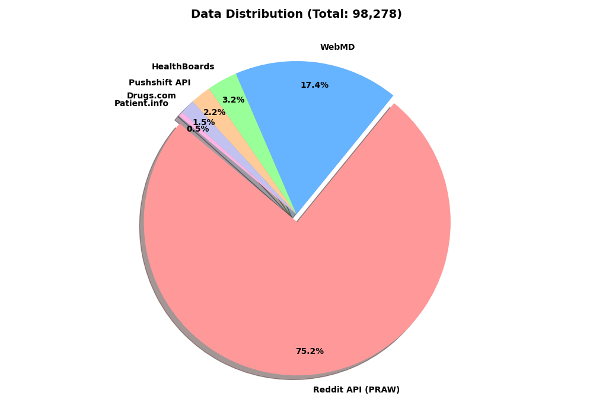
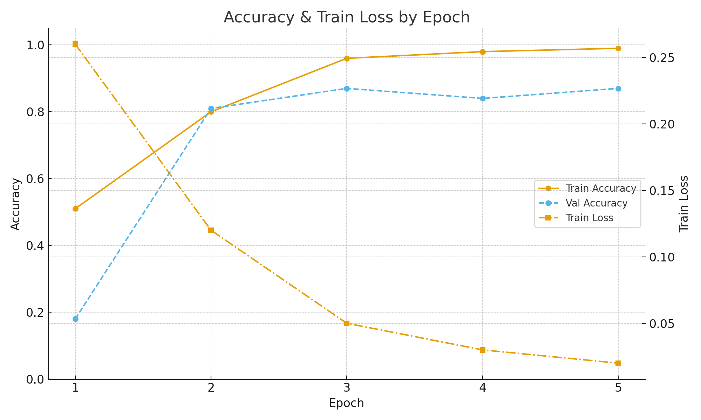
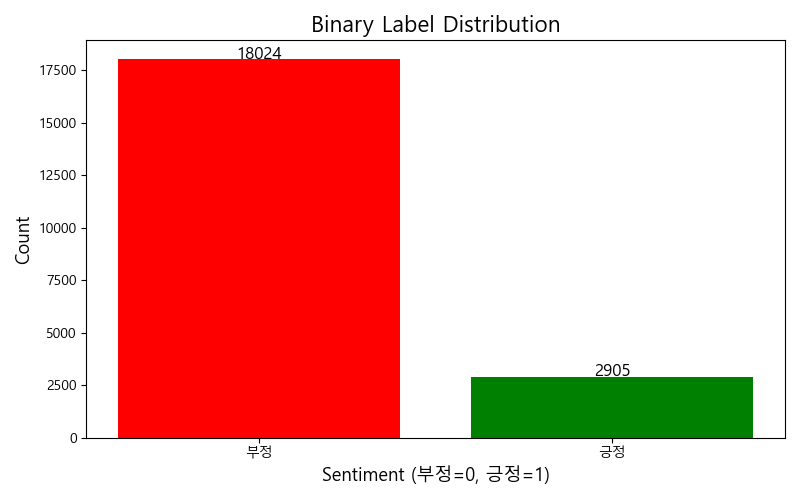
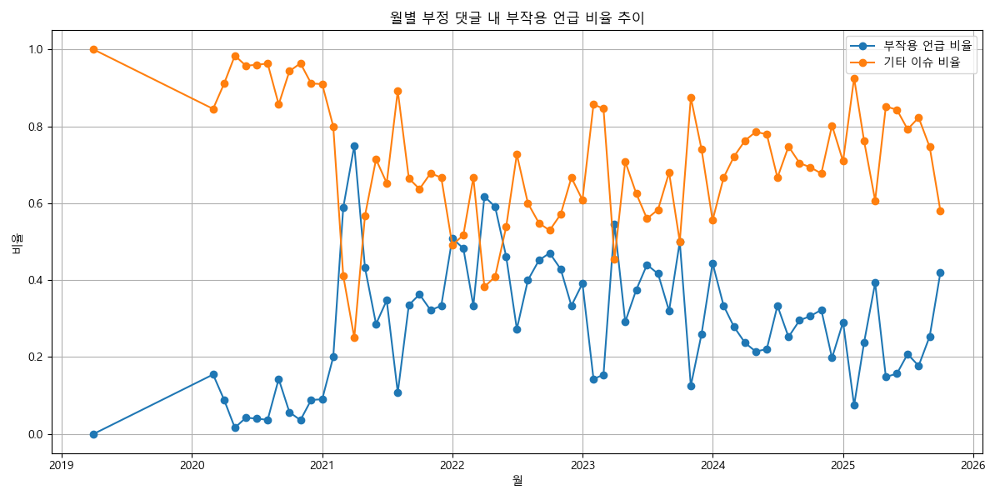
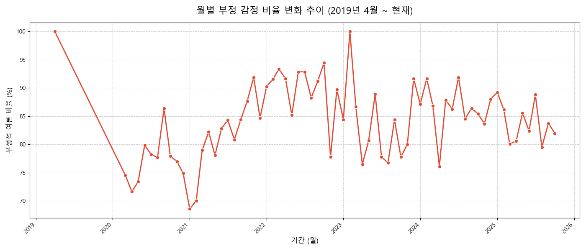

# 🦠 COVID Vaccine Controversy Analysis by BERT/DeBERTa
**온라인 댓글 기반 코로나 백신 여론 분석 프로젝트**

[](https://www.python.org/)
[](https://pytorch.org/)
[](https://huggingface.co/)
[](https://huggingface.co/docs/transformers/index)
[](https://huggingface.co/docs/transformers/model_doc/deberta_v2)
[](https://huggingface.co/monologg/koelectra-base-v3-discriminator)
[](https://maartengr.github.io/BERTopic/)
[](https://hdbscan.readthedocs.io/)
[](https://scikit-learn.org/)
[](https://pandas.pydata.org/)
[](https://numpy.org/)
[](https://matplotlib.org/)
[](https://jupyter.org/)

---

## 1. 연구 개요 (Overview)

### 1.1 왜 “백신 논란 댓글”을 주제로 선택했는가

본 연구에서 코로나 백신을 둘러싼 온라인 댓글을 분석 대상으로 삼은 이유는 필자의 경험, 진로, 그리고 팬데믹 시기에 느꼈던 문제의식이 함께 얽혀 있기 때문이다. 먼저 필자는 개인적으로 예방접종과 백신을 신뢰한다. 또한 우리 사회는 오랫동안 높은 예방접종률을 유지해 왔고, 백신은 공중보건의 기본적인 도구로 자리 잡아 왔다. 그럼에도 코로나 팬데믹 기간 동안 “백신 부작용”과 “백신 불신”은 온라인에서 가장 격렬하게 논쟁된 주제 중 하나였다. 이런 장면을 보면서, 부정적 여론이 실제 부작용의 위험 때문인지, 아니면 다른 요인들이 더 크게 작용하는지에 대한 의문이 자연스럽게 생겼다. “정말로 사람들은 부작용이 무서워서 백신을 거부하는 것일까?”라는 질문이 연구의 출발점이 되었다.

두 번째 이유는 팬데믹 동안 사람들의 감정이 어디에 기록되었는지에 대한 관찰이다. 정책 발표와 통계는 주로 기사 본문과 공식 브리핑에 남았지만, 실제 불안과 분노, 지지와 냉소는 댓글·포럼·SNS에 더 직접적으로 드러났다. 뉴스 기사가 “어떤 조치가 시행되었다”는 사실을 정리하는 영역이라면, 댓글은 “그래서 나는 어떻게 느끼는지”를 적는 공간에 가까웠다. 백신 논란을 이해하려면 기사만 보는 것이 아니라, 이 비공식적인 텍스트 영역을 별도로 분석할 필요가 있다고 판단했다.

세 번째 이유는 진로와의 연관성이다. 필자는 제약회사의 공정·시장 분석 분야를 진로로 고려하고 있다. 약품과 백신에 대한 시장 반응을 읽어야 하는 입장에서는, 단순 판매량보다 온라인에서 사람들이 어떤 경험을 나누고 어떤 감정을 표현하는지가 중요하다. 백신에 대한 감정과 여론을 데이터로 계량해 보는 작업은, 장차 실제 산업 현장에서 필요한 분석 능력을 연습해 보는 의미 있는 과제라고 생각했다.

마지막으로, 학창 시절 직접 겪은 팬데믹 경험이 있다. 여러 방역 대책과 정책이 충분한 데이터 없이 추진되거나, 현장의 현실과 맞지 않아 사회적 비용과 불신을 키우는 장면을 여러 번 목격했다. 지피지기면 백전불태라는 말처럼, 사람들이 실제로 무엇을 두려워하고 무엇에 분노하며 무엇을 불공정하게 느끼는지에 대한 이해가 부족하면 비슷한 상황이 반복될 수밖에 없다. 온라인 댓글 데이터를 정리하고 분석하는 일은 다음 팬데믹에서 어떤 의사결정과 커뮤니케이션 전략을 선택해야 할지 미리 설계해 보는 작은 출발점이 될 수 있다.

이러한 문제의식은 필자 개인의 경험에서만 나온 것이 아니라, 전문가 집단과 연구자들의 논의와도 맞닿아 있다. 세계보건기구(WHO)는 코로나19 이후 백신과 관련된 허위정보·과장된 주장·음모론이 온라인과 오프라인에서 과도하게 퍼지는 현상을 *infodemic*이라고 부르며, 이것이 백신 신뢰와 공중보건 대응을 약화시킨다고 반복해서 경고해 왔다 (World Health Organization, 2020; World Health Organization, 2020b). 이 개념은 단순히 백신의 임상적 효과만이 아니라, 백신을 둘러싼 정보 환경과 여론 구조 자체를 분석해야 한다는 문제의식을 전제로 한다.

국제적으로도 Reddit·Twitter 등 소셜 미디어의 텍스트를 수집하여 감성 분석과 토픽 모델링으로 COVID-19 백신에 대한 태도와 논쟁 구조를 분석한 연구들이 다수 보고되었다. Melton 등은 여러 개의 Reddit 커뮤니티에서 백신 관련 댓글을 수집해 감성 분석과 LDA 기반 토픽 모델링을 수행하며, 백신에 대한 신뢰와 불신이 어떤 이슈와 함께 나타나는지를 정리하였다 (Melton et al., 2021). Lyu 등과 Yin 등은 수백만 건의 트위터 데이터를 대상으로 백신 관련 토픽과 감성의 시계열 변화를 분석하면서, 정책 이벤트(승인, 접종, 중단 조치 등)가 여론에 미치는 영향을 정량적으로 보여 주었다 (Lyu et al., 2021; Yin et al., 2022).

따라서 “온라인 댓글과 게시글을 데이터로 삼아 백신 논란의 구조를 분석한다”는 접근은 더 이상 개인적 호기심 수준이 아니라, WHO와 여러 연구자들이 공유하는 문제의식 위에서 정당성을 인정받고 있는 연구 방향이다. 본 프로젝트는 이러한 선행 연구들의 흐름을 공유하면서, Reddit과 헬스 포럼, 약 리뷰 사이트 등 여러 플랫폼을 통합한 데이터셋을 구축하고 DeBERTa 기반 감성 분석과 BERTopic 토픽 모델링을 결합해, 백신 논쟁의 감성과 이슈 구조를 함께 해석하고자 한다.


이 연구는 결국 “백신이 위험한가 안전한가”라는 이분법적인 질문 대신, “사람들은 정확히 어떤 이유 때문에 불안해하고 분노하며 정책을 불신하게 되었는가”를 알고자 하는 시도라고 할 수 있다.

### 1.2 연구 질문

연구는 몇 가지 핵심 질문에 초점을 맞춘다. 첫째, Reddit·WebMD·HealthBoards·Drugs.com 등에서 수집한 코로나/백신 관련 댓글을 하나의 데이터로 통합했을 때, 전반적인 감성 분포는 어떻게 나타나는가, 다시 말해 부정과 긍정의 비율이 어느 정도인지 확인하고자 한다. 둘째, 수동 라벨링으로 구축한 약 2천여 개의 데이터에 대해 DeBERTa v3 기반 Binary 감성 분류 모델을 학습했을 때 어느 정도의 성능을 얻을 수 있는지, 그리고 이 모델을 전체 데이터에 적용했을 때 감성 구조를 얼마나 안정적으로 포착할 수 있는지 평가한다. 셋째, BERTopic과 HDBSCAN을 이용해 토픽 모델링을 수행하면 어떤 이슈들이 자연스럽게 묶이는지, 특히 부정 감성과 강하게 결합하는 토픽이 무엇인지 보고자 한다. 넷째, 시간의 흐름에 따라 부정·긍정 비율과 토픽의 중심축이 어떻게 이동하는지, 팬데믹 초기와 백신 도입기, 의무화 논쟁기, 규제 완화 이후가 서로 다른 양상을 보이는지 살펴본다.

이 질문들을 통해 궁극적으로 확인하고 싶은 것은 단순한 찬반 비율이 아니라, 부정 여론의 중심이 어디에 있었는지, 그 중심이 시간에 따라 어떻게 이동했는지이다. 다시 말해, “백신 자체에 대한 공포”와 “정책·의무화·경제·정치 갈등”이 각각 어느 정도 비중을 차지했는지를 구조적으로 파악하는 것이 연구의 목적이다.

---

## 2. 데이터 수집 (Data Collection)

### 2.1 수집 대상과 범위

데이터는 코로나와 백신에 대한 논의가 실제로 활발했던 여러 온라인 공간에서 수집하였다. Reddit는 익명성이 높고 토론이 자유로운 커뮤니티로, 백신과 마스크, 의무화, 음모론까지 다양한 의견이 한데 모이는 공간이다. WebMD와 HealthBoards는 건강과 질병을 중심으로 하는 포럼으로, 증상과 부작용, 가족의 치료 과정에 대한 긴 글이 자주 올라온다. Drugs.com은 약 리뷰 사이트로, 특정 백신을 접종한 나이와 부작용, 다시 맞을 의향이 있는지 등을 함께 적는 구조화된 후기가 많다. 그 외에 국내 사이트는 실험적으로 일부 시도했지만, 언어 혼합과 범위 문제로 최종 분석에서는 영어 데이터에 집중하였다.

이러한 사이트에서 코로나·백신 관련 키워드(예: covid, vaccine, pfizer, moderna, jab, side effect 등)를 중심으로 데이터를 수집한 결과, 최종적으로 약 9만 8천여 건의 원시 문장을 확보하였다. 플랫폼별 문서 수는 아래 표와 같이 정리된다.

| 출처 (Source)          | 건수 (최종) | 비율 (Percentage) |
|------------------------|-----------:|------------------:|
| Reddit API (PRAW)      | 73,934     | 75.23%            |
| WebMD                  | 17,055     | 17.35%            |
| HealthBoards           | 3,147      | 3.20%             |
| Pushshift API (Reddit) | 2,132      | 2.17%             |
| Drugs.com              | 1,523      | 1.55%             |
| Patient.info           | 487        | 0.50%             |
| **합계 (Total)**       | **98,278** | **100.00%**       |

이 표에서 볼 수 있듯, Reddit 계열 데이터가 전체의 약 4분의 3을 차지하여 커뮤니티 기반 논쟁을 잘 반영하고, 나머지는 의료 포럼과 약 리뷰 사이트에서 수집된 텍스트가 채워 연구에 임상 경험과 부작용 후기를 보완하는 역할을 한다.

데이터 분포를 시각적으로 나타내기 위해 플랫폼 비율을 파이 차트로 표현하였다.



### 2.2 수집 기간

분석 기간은 우연히 남아 있는 데이터 시점에 의존하지 않고, 팬데믹 전과 후, 백신 도입과 의무화, 규제 완화까지 한 흐름으로 관찰하기 위해 2019년 4월부터 2025년 10월까지로 설정하였다. 이 시기에는 팬데믹 이전의 백신·감염병 관련 배경 잡음, 2020년 이후 확진자와 사망자 증가로 인한 초기 공포, 2020년 말과 2021년 초의 백신 도입과 접종 시작, 이후 백신·마스크 의무화와 패스 제도를 둘러싼 갈등, 그리고 2023년 이후 규제 완화 이후에도 남는 잔존 논쟁까지 모두 포함된다. 날짜 정보는 각 사이트에서 제공하는 타임스탬프를 공통된 `created_at` 형식으로 변환해 관리하였다.

### 2.3 Reddit 데이터 수집 방식

Reddit 데이터는 PRAW 라이브러리를 활용하여 API 기반으로 수집하였다. 먼저 Reddit 개발자 계정을 통해 `client_id`, `client_secret`, `user_agent`를 발급받고 클라이언트를 설정하였다. 그 다음 코로나와 백신 관련 논의가 활발했던 여러 서브레딧을 미리 선정하였다. 각 서브레딧에 대해 `subreddit.top(time_filter="all")` 메서드를 사용해 팬데믹 전후 전체 기간에서 이슈를 대표하는 상위 게시글들을 가져왔고, 별도의 날짜 필터는 두지 않은 채 이후 통합 과정에서 날짜 범위를 통제하는 방식으로 접근하였다.

선택된 게시글마다 전체 댓글 트리를 평탄화하여 수집하였다. PRAW의 `submission.comments.replace_more(limit=None)`를 호출한 뒤 `submission.comments.list()`를 사용하여 상위 댓글과 대댓글을 모두 확보했다. 수집 단계에서 `[deleted]`나 `[removed]`처럼 이미 삭제된 댓글은 1차적으로 제외하고, 공백을 제거한 뒤 길이가 20자 미만인 매우 짧은 잡담은 노이즈로 간주하여 필터링하였다. 각 댓글에 대해서는 본문 텍스트인 `body`와 함께 작성 시각 `created_utc`, 점수 `score`, 서브레딧 이름, 게시글 ID, 댓글 ID, 부모 ID 등을 함께 저장하였다. 이후 `created_utc`는 사람이 읽을 수 있는 `created_at` 시각으로 변환하였다.

### 2.4 원시 댓글 예시

아래 표는 실제로 수집된 원시 댓글 일부를 보여 준다. 각 플랫폼에서 사람들이 어떤 방식으로 경험과 감정을 서술하는지 감을 잡을 수 있다.

| source         | created_at        | text (원문 일부) | 원문 링크 (URL) |
|----------------|-------------------|------------------|------------------|
| `Reddit`       | 2021-01-15 13:24  | "I got my second Pfizer shot yesterday and my arm hurts like hell, but honestly it's nothing compared to getting covid. My parents are getting theirs next week..." | [원문 링크](https://www.reddit.com/r/TrueUnpopularOpinion/comments/1o9kdat/modern_covid_vaccines_were_not_safe_and_effective/) |
| `WebMD`        | 2021-03-02 08:11  | "After the Moderna vaccine I had chills and a fever for one night. I was scared because of all the news, but my doctor said it was a normal immune response..." | [원문 링크](https://www.healthboards.com/boards/search_google.php?cx=partner-pub-8247140117206678%3A125c5bc0u3i&cof=FORID%3A11&ie=UTF-8&q=covid+vaccine&sa=search) |
| `HealthBoards` | 2020-11-28 21:03  | "My mom is in the hospital and they're talking about this new vaccine. I'm worried about long term side effects, but also about her catching covid while waiting..." | [원문 링크](https://www.webmd.com/vaccines/covid-19-vaccine/default.htm) |
| `Drugs.com`    | 2021-05-07 17:40  | "Vaccine: [brand]. Age: 35. Side effects: sore arm, mild headache, fatigue for 2 days. Would still recommend, it's better than the risks of covid." | [원문 링크](https://www.drugs.com/comments/covid-19-mrna-moderna-vaccine/) |

이와 같이 Reddit는 감정이 드러나는 논쟁형 댓글이 많고, WebMD와 HealthBoards는 진료 경험과 가족 이야기를 담은 장문이 많으며, Drugs.com은 짧지만 구조화된 후기가 중심이라는 차이를 확인할 수 있다.

---

## 3. 데이터 전처리

### 3.1 전처리 파이프라인

전처리는 단순히 텍스트를 깔끔하게 만드는 수준을 넘어서, 코로나/백신 논의와 실질적으로 관련된 문장만 남기는 것을 목표로 설계하였다. 전체 과정은 네 단계로 요약할 수 있다.
첫 번째 단계는 구조적 노이즈 제거이다. `[deleted]`, `[No Content]`처럼 이미 삭제되었거나 내용이 없는 게시물은 모두 제거하였다. 또한 “lol”, “ok”처럼 20자 미만이면서 단어 수가 다섯 개 미만인 매우 짧은 문장은 명확한 의견이나 감정을 담기 어렵다고 보고 제외하였다.
두 번째 단계는 언어 필터링이다. 영어 기반 사전학습 모델을 사용할 예정이기 때문에, 영어가 아닌 언어가 지나치게 섞인 문장은 분석에서 오히려 잡음이 될 가능성이 크다. 이에 따라 비영어 문자의 비율이 일정 기준 이상인 문장을 제거하여 영어 중심의 일관된 코퍼스를 만들었다.
세 번째 단계는 형식적 노이즈 제거 단계이다. URL과 이모티콘, HTML 태그, 과도한 특수문자 등을 제거하고, 모든 텍스트를 소문자로 변환한 뒤 공백을 정규화하였다. 이 단계까지 진행하면 텍스트는 기본적으로 깔끔해지지만, 여전히 코로나/백신과 직접 관련이 없는 잡담이 많이 남아 있다.
네 번째 단계에서는 주제 관련성 필터링을 수행하였다. 이를 위해 코로나/백신 논쟁에서 실제로 자주 등장하는 핵심 키워드 목록을 만들었다. 예시는 아래와 같다.

```python
KEYWORDS = [
    'vaccine', 'covid', 'coronavirus', 'side effect', 'adverse', 'pfizer', 'moderna',
    'booster', 'jab', 'shot', 'vax', 'myocarditis', 'astrazeneca', 'janssen',
    'symptoms', 'mandate', 'mask', 'masked', 'unvaccinated', 'vaxxed', 'unvaxxed',
    'hospital', 'death', 'long covid', 'long-covid', 'spike protein', 'mrna'
]
```
문장 안에 이 키워드 중 하나도 등장하지 않으면 코로나/백신 논의와 직접 관련이 없다고 보고 “주제 무관(False)”으로 분류하여 분석 대상에서 제외하였다. 전처리의 핵심 원칙은 “데이터 양을 줄이더라도, 코로나/백신 논쟁에 실제로 해당하는 문장만 남기자”였다.

### 3.1.1 전처리 버전과 강화 과정

실제 구현 과정에서는 전처리를 한 번에 완성하지 않고, 여러 버전을 거치면서 점진적으로 강화하였다. 초기에는 특수문자와 이모티콘 제거, 소문자 변환 정도만 적용하는 최소 전처리를 시도하였다. 그러나 이 상태에서 LDA 토픽 모델링을 수행해 보니 상위 키워드에 `http`, `www`, `com`, `trump`, `biden`, `news`처럼 링크와 정치인 이름, 사이트 이름이 과도하게 등장하였다. 이 수준의 전처리만으로는 백신 논란의 구조를 보기 어렵다는 결론에 도달했다.

그 다음에는 URL과 이모티콘, 각종 특수문자를 제거하고 불용어를 조금 더 정리한 버전을 실험하였다. 이 버전에서 LDA 토픽 상위 단어에는 `mask`, `vaccine`, `company`, `money`, `hospital` 등 비교적 의미 있는 단어가 나타나기 시작했지만, 여전히 코로나/백신과 직접 관련 없는 일반 잡담이 상당수 포함되어 있었다. 이를 해결하기 위해 앞서 소개한 키워드 기반 주제 관련성 필터를 추가 도입하였다.

키워드 기반 필터를 적용한 결과, 약 9만 8천여 건의 원시 데이터 중 2만 3천여 건이 코로나/백신 관련 텍스트(True)로 남고, 나머지 7만 5천여 건은 주제 무관(False)으로 제외되었다. 이후 True 데이터의 10%를 무작위로 추출해 직접 읽어 보면서 필터가 제대로 작동했는지 점검하였다. 대부분은 실제로 코로나/백신 논의였지만, 링크만 공유하거나 단순 정보 전달에 그쳐 감정이 거의 드러나지 않는 문장은 추가로 제거할 필요가 있었다. 약 1,010개의 행을 이런 기준으로 삭제했고, 이 과정에서 함께 제거되었지만 감정 표현이 분명했던 423개의 문장은 별도로 복구하여 다시 포함하였다.

전처리 단계별 데이터 수 변화는 다음과 같이 정리된다.

### 3.1.2 전처리 단계별 데이터 수 변화

| 단계 | 설명 | 남은 데이터 수(건) |
|------|------|--------------------|
| 0. Raw merged | 여러 사이트에서 크롤링한 뒤, 기본적인 형식 통일만 수행한 상태 | 약 98,278건 |
| 1. 구조적 노이즈 제거 | `[deleted]`, 너무 짧은 잡담, 내용 없는 문장 제거 | 약 90,000건 내외 |
| 2. 언어 필터링 | 비영어 텍스트 제거 | 약 82,000건 |
| 3. 주제 관련성 필터링 | 코로나/백신 관련 키워드가 하나도 없는 문장 제거 | 관련 있음(True): 23,939건 / 관련 없음(False): 75,338건 |
| 4. 링크·정보 공유 위주 문장 제거 | 링크 공유·정보 전달 위주로 감정이 거의 없는 문장 추가 삭제 | 23,352건 |
| 5. 최종 분석·학습용 데이터 | 날짜·텍스트·사이트 정보가 완비된 최종본 | 20,929건 |

이 과정을 통해 약 10만 건이던 원시 데이터는 2만여 건의 고순도 데이터셋으로 압축되었다. 중요한 점은 단순히 데이터 양을 줄인 것이 아니라, “코로나/백신 논쟁과 감정을 담고 있는 문장만 남긴다”는 방향으로 설계했다는 점이다.

### 3.1.3 전처리 예시

전처리의 실제 효과를 보여 주기 위해 Reddit에서 가져온 댓글 하나가 단계별로 어떻게 변하는지 예시를 제시한다.

| 단계 | 내용 |
|------|------|
| Raw 원문 | "Here's the link to the article about covid vaccines: https://[...] Honestly I'm scared of the side effects, but also I don't want my dad to end up in the hospital again." |
| 최소 전처리 | "heres the link to the article about covid vaccines https honestly im scared of the side effects but also i dont want my dad to end up in the hospital again" |
| 키워드 필터 통과 여부 | `covid`, `vaccines`, `side effects`, `hospital`이 포함되어 주제 관련(True)으로 유지 |

이 예시에서 최소 전처리는 형식적인 노이즈를 제거하는 역할을 하고, 키워드 필터는 이 문장이 실제로 코로나/백신 논의에 해당하는지 판단하는 역할을 한다. 최종적으로는 형식적으로 정제되어 있으면서도 의미상으로 코로나/백신 논쟁에 속하는 문장만 남게 된다.

---

## 4. 수동 라벨링과 감성 분석 모델

### 4.1 수동 라벨링 데이터 구성

감성 분류 모델을 신뢰할 수 있으려면 학습에 사용할 골드 레이블이 필요하다. 이를 위해 정제된 데이터 중 약 10%에 해당하는 2,100여 개의 문장을 무작위로 샘플링하여 사람이 직접 라벨링을 수행하였다. 각 문장에 대해 두 가지 라벨을 동시에 부여하였다. 하나는 부정(0)과 긍정(1)으로 구성된 Binary 라벨이고, 다른 하나는 부정(0)·중립(1)·긍정(2)으로 구성된 Three-Class 라벨이다. 라벨 분포를 보면 Binary 기준으로는 부정이 약 80%를 넘고, 긍정은 20% 미만이었다. Three-Class 기준에서는 부정이 60%대, 중립과 긍정이 각각 10%대 후반을 차지해 전반적으로 부정에 치우친 데이터 구조임을 확인할 수 있었다.

수동 라벨링 예시는 다음과 같다.

| id  | text (일부) | Binary 라벨 |
|-----|-------------|-------------|
| ex1 | "The vaccine saved my parents. They both caught covid before and this time it was just like a mild cold." | 1 (긍정) |
| ex2 | "I'm not anti-vax but the mandate at my job is ridiculous. People are getting fired over this." | 0 (부정) |
| ex3 | "Had fever and chills for one night after Moderna, totally worth it if it keeps me out of ICU." | 1 (긍정) |
| ex4 | "My friend developed heart issues after the shot, doctors keep saying it's unrelated but I'm not convinced." | 0 (부정) |

이 예시에서 볼 수 있듯, 단순히 부작용을 언급했다고 해서 모두 부정으로 분류되는 것은 아니며, 부작용을 감수할 가치가 있다고 평가하는 문장은 긍정으로, 의사와 시스템을 신뢰하지 못하는 문장은 부정으로 구분하였다.

### 4.2 모델 선택과 학습

여러 후보 모델 중에서 최종적으로는 DeBERTa v3 기반 Binary 분류 모델을 선택하였다. 초기에는 한국어 데이터를 고려해 KoELECTRA로 Binary·Three-Class 실험을 모두 진행했고, 영어 데이터에 대해서는 BERT 기반 모델을 베이스라인으로 사용하였다. 그러나 Three-Class 설정에서는 중립 클래스의 경계가 모호하고 라벨 노이즈가 많아 모델이 안정적으로 수렴하지 않았다. 중립 문장은 사실 전달과 약한 감정이 섞여 있는 경우가 많았기 때문에, 최종 분석에서는 부정과 긍정을 구분하는 Binary 설정에 집중하였다.

DeBERTa v3 Binary 모델은 CrossEntropy 손실 함수에 클래스 불균형을 보정하는 가중치를 적용해 학습하였다. 옵티마이저는 AdamW를 사용했고, 학습률과 배치 크기, Epoch 수 등은 여러 차례 실험을 거쳐 조정하였다. Early Stopping은 검증 정확도와 검증 손실을 기준으로 3~5 Epoch 구간에서 적용하였다.

다음 표는 대표적인 Epoch별 학습 로그를 보여 준다.

| Epoch | Train Loss | Train Acc | Val Acc |
|-------|-----------:|----------:|--------:|
| 1     | 0.26       | 0.51      | 0.18    |
| 2     | 0.12       | 0.80      | 0.81    |
| 3     | 0.05       | 0.96      | 0.87    |
| 4     | 0.03       | 0.98      | 0.84    |
| 5     | 0.02       | 0.99      | 0.87    |

Epoch 1에서 모델은 기본적인 패턴을 빠르게 학습하면서 검증 정확도가 0.18에서 0.81로 급상승한다. Epoch 3에서는 학습 정확도 약 0.96, 검증 정확도 약 0.87 수준으로 일반화 성능이 가장 안정적으로 나타난다. Epoch 4에서는 학습 정확도가 0.98까지 올라가지만 검증 정확도가 일시적으로 0.84로 떨어져 과적합의 신호를 보인다. Epoch 5에서는 검증 정확도가 다시 0.87로 회복되지만, 라벨 노이즈와 특정 표현에 과도하게 맞춰질 위험도 함께 커진다. 이런 패턴을 종합적으로 고려하여 3~5 Epoch 구간을 Early Stopping 후보 범위로 설정하고, 최종적으로 Validation Accuracy 약 0.87 수준의 DeBERTa v3 Binary 모델을 채택하였다.

Epoch별 정확도와 손실의 변화를 시각화한 그래프는 다음과 같다.



---

## 5. 주요 결과 (Results)

### 5.1 전체 감성 분포

최종 전처리를 마친 20,929건의 문장에 DeBERTa v3 Binary 모델을 적용한 결과, 부정과 긍정의 비율은 아래와 같다.

| 감성              | 개수   | 비율    |
|-------------------|-------:|--------:|
| 부정 (Negative)   | 18,024 | 약 86%  |
| 긍정 (Positive)   | 2,905  | 약 14%  |

코로나/백신 관련 온라인 댓글은 전반적으로 긍정보다 부정이 절대적으로 우세한 구조를 보인다. 이는 단순한 인상 차원이 아니라, 텍스트 단위로 모델이 분류한 결과에서도 뚜렷하게 확인되는 패턴이다.



### 5.2 부정 토픽과 긍정 토픽의 개요

BERTopic과 HDBSCAN을 이용해 부정 문장 1만 8천여 건의 토픽 구조를 살펴본 결과, 병원비와 의료 시스템에 대한 불만, 마스크·백신 의무화와 직장·상점 규정 갈등, 정치적 책임 공방, 백신 부작용과 장기 후유증에 대한 우려, 아동과 취약계층에 대한 걱정, 그리고 “covid hoax”나 “propaganda”처럼 음모론적 프레이밍을 사용하는 토픽 등이 주요 축으로 등장하였다. 이 중 일부는 직접적인 의학적 위험과 관련이 있지만, 상당수는 제도와 비용, 강제 방식, 정치적 갈등에 대한 불만과 결합해 있다.

긍정 문장 2,900여 건을 대상으로 같은 방법을 적용하면, mRNA 백신의 효과를 옹호하는 토픽, 팔 통증과 발열 같은 경미한 부작용을 공유하면서도 접종을 긍정적으로 평가하는 토픽, 의료진과 병원 시스템의 노력을 인정하는 토픽, 마스크와 규정 준수를 타인 보호의 관점에서 바라보는 토픽 등이 나타난다. 같은 “병원·마스크·백신”이라는 단어가 상황과 맥락에 따라 전혀 다른 감성으로 연결된다는 점이 이 결과에서 드러난다.

### 5.3 “부작용”과 기타 이슈의 시간적 구조

부정 댓글 중에서 백신 부작용과 직접 관련된 키워드(예: side effects, reaction, myocarditis, long term 등)가 포함된 비율을 월별로 계산하면, 시간이 지나면서 논란의 중심이 어떻게 이동했는지 보다 분명하게 볼 수 있다. 아래 그래프는 월별 부정 댓글에서 부작용 언급이 차지하는 비율의 변화를 보여 준다.



팬데믹 초기에는 부작용 언급 비율이 거의 0에 가까우며, 부정 댓글의 상당 부분은 감염 자체에 대한 공포와 봉쇄·락다운, 경제적 피해, 정치적 책임 공방에 집중되어 있다. 2020년 말과 2021년 초로 넘어가면서 백신 도입과 접종이 본격화되자, 부작용 언급 비율이 짧은 기간 동안 0.6~0.7 수준까지 급등한다. 이 시기에는 새로 도입된 백신의 안전성과 장기 후유증에 대한 불안이 부정 여론의 핵심 축으로 부상했음을 알 수 있다.

이후 접종이 어느 정도 진행되고 실제 경험이 축적되면서, 부작용 언급 비율은 다시 0.2~0.4 사이로 내려와 비교적 안정된 구간에 머문다. 그러나 전체 부정 비율은 여전히 높게 유지된다. 이는 부정 여론의 상당 부분이 부작용과 직접 관련되지 않은 다른 이슈들, 예를 들어 의무화 정책, 직장과 상점의 규정 적용 방식, 병원비와 의료 시스템, 정치적 갈등과 음모론적 프레이밍 등에서 비롯되고 있음을 시사한다.

### 5.4 부정 비율의 시계열 변화

월별 부정 감정 비율을 전체 기간에 걸쳐 살펴보면, 팬데믹의 진행과 정책 변화에 따라 여론의 강도가 어떻게 출렁였는지 확인할 수 있다. 아래 그래프는 2019년부터 2025년까지 부정 비율의 시계열 변화를 정리한 것이다.



팬데믹 선언 전후에는 전반적으로 높은 부정 비율이 형성되지만, 이후 일시적으로 다소 내려가는 구간도 존재한다. 백신 도입과 접종이 본격화되는 시기에는 다시 부정 비율이 크게 상승하며, 특히 의무화와 관련된 논쟁이 집중된 2021부터 2022년 구간에서는 80에서 90% 수준의 높은 부정 비율이 장기간 유지된다. 이후 규제 완화와 일상 회복 논의가 진행되면서 전체적인 강도는 조금 완화되지만, 부정 비율이 50% 이하로 떨어져 안정적인 균형을 이루는 단계까지 내려가지는 않는다. 팬데믹이 공식적으로 종료된 이후에도 아동 접종, 장기 후유증, 음모론 등 일부 토픽이 꾸준히 남아 있기 때문이다.

이러한 시계열 결과를 앞서의 토픽 구조와 함께 보면, 논란의 중심이 “새로운 백신의 안전성”에서 “백신을 둘러싼 제도·강제 방식·비용과 책임의 배분 구조”로 점차 이동해 왔다는 해석이 가능하다.

---

## 6. 논의 (Discussion)

이 프로젝트의 결과는 백신 논란을 단순히 “부작용 공포”의 문제로 보는 시각이 충분하지 않다는 점을 보여 준다. 초기에는 새로운 백신의 안전성과 장기 후유증에 대한 불안이 부정 여론을 크게 자극했지만, 시간이 지나면서 그 중심은 정책과 제도, 특히 의무화 방식과 경제적 부담, 정치적 책임 공방으로 이동하였다. 마스크와 백신을 어디까지 강제할 것인지, 미접종자의 출근과 이동을 어떻게 제한할 것인지, 부작용이 발생했을 때 누가 비용과 책임을 져야 하는지에 대한 논란이 장기적으로 더 중요한 역할을 했다는 것이다.

공중보건 커뮤니케이션 관점에서 보면, “백신은 안전하다”라는 메시지 하나만으로는 이런 구조를 설득하기 어렵다. 사람들은 백신 자체의 위험뿐 아니라, 백신이 포함된 전체 시스템을 함께 평가한다. 정책이 어떻게 설계되었는지, 예외와 보상 규정이 어떤지, 의사 결정 과정이 투명하게 공개되는지 등을 종합적으로 판단한다. 그러므로 향후 비슷한 상황에서 신뢰를 확보하기 위해서는 약의 효과와 안전성에 대한 설명과 더불어, 제도와 책임 구조에 대한 구체적인 안내가 함께 제시되어야 한다.

의료 정책과 의료기관 관점에서 보면, 병원비와 빚, 간호 인력 부족과 같은 키워드가 반복적으로 등장한다는 사실도 중요하다. 백신을 맞느냐의 문제는 종종 “아프면 얼마나 비용을 부담해야 하는가”라는 질문과 함께 고민된다. 무료 접종과 보험 적용, 부작용 발생 시 보상 체계가 구체적으로 안내되지 않으면, 의료비에 대한 근본적인 불안이 백신 논란과 결합해 부정 여론을 강화할 수 있다.

정보 플랫폼과 언론의 역할도 분명하다. “covid hoax”나 “propaganda” 같은 표현이 독립된 토픽으로 형성되었다는 사실은, 음모론적 프레이밍이 여론 구조에서 일정 비중을 차지한다는 뜻이다. 이를 단순히 댓글 차단이나 삭제의 문제로만 볼 것이 아니라, 어떤 시점에 어떤 키워드가 급증하는지 모니터링하고, 그때 어떤 정보와 설명을 노출해야 하는지 고민하는 자료로 활용할 수 있다.

---

## 7. 결론 (Conclusion)

이 연구는 팬데믹 동안 온라인에 쌓인 코로나 백신 관련 댓글과 리뷰를 통해, 사람들이 무엇을 두려워하고 무엇에 분노해 왔는지 구조적으로 살펴보려는 시도였다. 약 10만 건의 원시 데이터를 크롤링하고, 전처리와 주제 관련성 필터링을 통해 2만여 건의 고순도 데이터셋을 만들었다. 그 중 2천여 건을 수동 라벨링하여 DeBERTa v3 기반 Binary 감성 분류 모델을 학습했고, 이 모델의 예측 결과를 BERTopic 토픽 모델링과 결합해 백신 논란의 구조와 시간 흐름을 분석하였다.

분석 결과, 전체 기간에 걸쳐 부정 여론이 압도적인 비중을 차지하며, 이는 팬데믹이라는 극단적인 상황을 반영한다. 그러나 부정의 내용은 시간에 따라 변해 왔다. 초기에는 감염과 봉쇄, 정치적 책임 공방이, 백신 도입기에는 부작용과 장기 후유증 불안이, 이후에는 의무화 방식과 의료비, 정치적 갈등과 음모론이 각 시점의 핵심 이슈로 등장하였다. 이 흐름을 따라가 보면, “백신 반감 = 부작용 공포”라는 단순한 도식으로는 온라인 논의를 설명하기 어렵다는 점이 드러난다.

연구자 개인에게는 약품과 백신에 대한 시장 반응을 볼 때 효능과 안전성이라는 의학적 지표뿐 아니라, 정책과 비용, 책임 구조까지 함께 읽어야 한다는 교훈을 남긴다. 사회 전체적으로는 다음 팬데믹에서 더 나은 결정을 내리기 위해, 약의 과학적 근거와 함께 제도와 커뮤니케이션의 설계를 동일한 수준의 진지함으로 다루어야 한다는 메시지를 전달한다. 이 프로젝트는 그 방향에 대한 하나의 기초 자료로 남을 수 있을 것이다.

---

## 8. 데이터 / 폴더 구조 (Data & Folder Layout)

### 8.1 디렉터리 구조 개요

프로젝트 데이터와 코드는 다음과 같은 구조로 정리하였다.

```text
data/
├─ raw/                     # 크롤링 직후 또는 최소 전처리 상태의 원본 데이터
│   ├─ FINAL_DATA_CLEANED_READY.csv
│   ├─ FEAR_raw.csv / FEAR_source.csv   # (옵션) 공포지수 원본
│   └─ ... (개별 사이트별 원본 CSV들)
│
├─ interim/                 # 중간 전처리/필터링 결과
│   ├─ FINAL_DATA_FILTERED_#TRUE.csv
│   │   # is_related_topic = True 인 코로나/백신 관련 텍스트만 남긴 버전
│   ├─ FINAL_DATA_FILTERED_#FALSE.csv
│   │   # 관련성이 낮아 제거된 텍스트 (분석에는 사용 X, 검증용으로 보관)
│   ├─ FINAL_DATA_ROWS_#DELETED.csv
│   │   # 링크 공유 위주·의견/감정이 거의 없는 중립 문장 추가 삭제본
│   └─ ... (필요한 중간 버전들)
│
├─ processed/               # 분석/모델 학습에 사용되는 최종본
│   ├─ DDDD.csv
│   │   # 최종 분석용 메인 데이터셋
│   │   # (정제 완료 텍스트 + 날짜 + 사이트 정보 + 모델 예측 감성 등)
│   ├─ labeled_output#.csv
│   │   # 전체 데이터의 약 10% 샘플에 대해
│   │   # 사람이 직접 Binary/Three-Class 감성 라벨을 붙인 결과
│   ├─ 10_per#_final.csv
│   │   # 수동 라벨링 정제본 (학습/검증에 실제 사용한 버전)
│   └─ ... (토픽모델링/시계열용으로 가공된 추가 CSV가 있다면 여기에)
│
└─ external/                # 외부 지표/보조 데이터
    ├─ FEAR#.csv
    │   # 공포·탐욕 지수(Fear-Greed Index) 시계열
    │   # 날짜(date) 기준으로 DDDD.csv의 부정 비율과 merge해서 사용
    └─ ... (향후 추가할 다른 외부 지표들)
```

### 8.2 주요 CSV 파일 설명

| 파일명 | 역할/내용 |
| --- | --- |
| `FINAL_DATA_CLEANED_READY.csv` | 여러 소스에서 크롤링한 원본 데이터를 기본적인 정제(삭제된 글, 너무 짧은 글, 비영어 등)까지 마친 통합본 |
| `FINAL_DATA_FILTERED_#TRUE.csv` | 통합본에서 코로나/백신 관련 키워드가 포함된 행만 남긴 버전. 분석에 사용하는 “관련 있음(True)” 데이터 |
| `FINAL_DATA_FILTERED_#FALSE.csv` | 주제 관련성이 낮아 분석에서 제외하지만, 필터링 정확도를 검토하기 위해 보관하는 데이터 |
| `FINAL_DATA_ROWS_#DELETED.csv` | True 데이터 중 링크만 공유하거나 의견·감정이 거의 없는 문장을 추가로 제거한 버전 |
| `FINAL_DATA_ROWS_DELETED_2.csv` | 삭제 과정에서 함께 제거되었지만 감정이 있는 문장 423개를 복구하여 포함한 버전 |
| `DDDD.csv` | 최종 분석용 메인 데이터셋. 전처리와 주제 필터링, 링크/중립 삭제를 거친 뒤 DeBERTa Binary 모델의 감성 라벨이 부여된 상태 |
| `labeled_output#.csv`, `10_per#_final.csv` | 전체 데이터 중 약 10%를 샘플링해 사람이 직접 부정/중립/긍정 라벨을 붙인 결과. 모델 학습·검증에 사용되는 골드 레이블 세트 |

---

## 9. 부록 (Appendix – 시행착오와 중간 실험과 참고 문헌)

본문에서는 전체적인 스토리 흐름과 최종 파이프라인에 집중하였다. 이 부록에서는 그 과정에서 거쳤던 시행착오와 중간 실험 결과를 간단히 정리한다. 코드나 수식보다, 어떤 선택을 했고 무엇을 버렸는지를 기록해 두는 데 목적이 있다.

### 9.1 KoELECTRA와 Three-Class 실험

초기에는 한국어 데이터 확장을 염두에 두고 KoELECTRA 모델을 사용해 Binary와 Three-Class 두 가지 설정을 모두 실험하였다. Binary 설정에서는 검증 정확도 0.8 안팎의 무난한 결과를 얻었다. 그러나 Three-Class 설정에서는 중립 클래스의 경계가 모호했고, 모델이 부정과 긍정에 비해 중립을 거의 인식하지 못하는 문제가 반복되었다.

혼동 행렬을 보면 실제 중립 문장을 부정으로 예측하는 경우가 많았고, 모델이 사실상 “부정 vs 나머지” 구조로 수렴하는 경향이 나타났다. 라벨링 기준을 다시 정의하고 애매한 문장을 재라벨링하는 작업도 해 보았지만, 데이터 구조 자체가 부정에 크게 치우쳐 있는 상황에서는 Three-Class를 안정적으로 학습시키기 어려웠다. 이 경험을 바탕으로 최종 분석은 Binary 설정에 집중하게 되었다.

### 9.2 불균형 데이터 처리 전략

데이터 자체가 부정 80% 이상, 긍정 20% 미만의 불균형 구조를 갖고 있었기 때문에 여러 불균형 처리 전략을 실험하였다. 소수 클래스(긍정)를 단순 복제하는 oversampling은 초반에는 F1-score를 소폭 개선하지만, Epoch를 많이 늘리면 소수 클래스 일부 샘플에 과적합하는 문제가 나타났다.

반면 클래스별 가중치를 적용한 CrossEntropy Loss는 비교적 안정적으로 작동하여 Binary DeBERTa 모델의 검증 정확도를 끌어올리는 데 도움이 되었다. Focal Loss도 일부 설정에서는 유효했지만, 파라미터에 민감하고 손실 곡선이 불안정해지는 경우가 있어 최종적으로는 “클래스 가중치 + 적절한 Epoch + Early Stopping” 조합이 가장 현실적인 선택으로 남았다.

### 9.3 LDA에서 BERTopic으로의 전환

토픽 모델링 단계에서도 시행착오가 있었다. 처음에는 LDA를 사용해 전체 이슈 지형을 파악하였다. Bag-of-Words 기반 토픽 모델은 구현이 간단하고 상위 단어 리스트를 해석하기 쉽다는 장점이 있었지만, 전처리가 조금만 부족하면 URL이나 정치인 이름, 사이트 도메인명이 섞인 가비지 토픽이 쉽게 생겼다. 또한 Reddit·포럼 데이터처럼 문장 길이와 표현 방식이 다양한 텍스트에서는 정교한 클러스터링에 한계가 있었다.

이 한계를 극복하기 위해 문장 임베딩과 밀도 기반 클러스터링을 결합한 BERTopic과 HDBSCAN을 도입하였다. 전처리와 주제 필터링을 거친 텍스트에 대해 임베딩을 생성한 뒤 HDBSCAN으로 클러스터를 만들고, 각 클러스터에 대표 단어와 예시 문장을 부여한 뒤 사람이 직접 토픽 이름을 붙였다. 밀도가 낮은 문서는 자동으로 노이즈 토픽으로 분리되어 의미 없는 집합이 정리되었다. 이 과정에서 “의료비·병원 시스템 불만”, “마스크·상점 규정 갈등”, “음모론·hoax 프레이밍”처럼 해석 가능한 토픽이 뚜렷하게 드러나 LDA보다 해석 가능성과 안정성이 높다고 판단하였다.

### 9.4 DeBERTa v3 최종 선택 과정

DeBERTa v3 Binary 모델을 선택하는 과정에서도 Epoch 수와 학습률, 불균형 처리 조합을 바꾸어가며 여러 실험을 수행하였다. Epoch를 너무 적게 주면 패턴을 충분히 학습하지 못하고, 너무 많이 주면 라벨 노이즈와 특정 표현에 과적합하는 문제가 생겼다. 대표적인 Epoch별 로그는 다음과 같다.

| Epoch | Train Loss | Train Acc | Val Acc |
|-------|-----------:|----------:|--------:|
| 1     | 0.26       | 0.51      | 0.18    |
| 2     | 0.12       | 0.80      | 0.81    |
| 3     | 0.05       | 0.96      | 0.87    |
| 4     | 0.03       | 0.98      | 0.84    |
| 5     | 0.02       | 0.99      | 0.87    |

Epoch 3~5 구간이 성능과 안정성 측면에서 가장 적절한 타협점이었다. 이 범위 안에서 Early Stopping을 적용해 최종 모델을 결정하였고, Validation Accuracy 약 0.87 수준의 결과를 얻었다. 온라인 댓글처럼 잡음이 많고 라벨 편향이 강한 데이터에 대해 현실적으로 달성 가능한 수준이라고 판단하였다.

Epoch별 정확도와 손실의 변화를 시각화한 그래프는 다음과 같다.


### 9.5 이 프로젝트가 남긴 것

이 부록에 정리한 시행착오는 실패한 코드나 로그의 기록이라기보다, 어떤 선택을 했고 무엇을 버리고 무엇을 채택했는지에 대한 의사결정 과정의 기록이다. 여러 전처리 버전과 라벨링 기준, 모델 조합을 거쳐 최종적으로 “전처리와 주제 필터링을 강화한 뒤, Binary DeBERTa 모델과 BERTopic을 결합해 백신 논란의 구조를 본다”는 방향이 정리되었다.

이 기록은 향후 비슷한 프로젝트를 수행할 때 불필요한 시행착오를 줄이는 데 도움이 될 것이며, 동시에 본 연구의 결론이 어떤 선택 위에서 성립하는지 투명하게 보여 주기 위한 것이다.

---

### 9.6 Reddit 크롤링 세부 전략 (PRAW 기반 구현)

이 절에서는 본문 2.4절에서 개략적으로만 언급했던 Reddit 데이터 수집 과정을 코드 수준에서 조금 더 구체적으로 정리한다. 실제 저장소에서는 별도의 `reddit_crawler.py` 또는 노트북 형태로 관리하는 것이 바람직하다.

정리하면 다음과 같은 요소들로 구성되어 있다.

- PRAW 인증 및 클라이언트 설정 방식  
- 타깃 서브레딧 리스트 구성  
- `subreddit.top(time_filter="all", limit=POST_LIMIT)` 호출 방식  
- `submission.comments.replace_more(limit=None)` + `submission.comments.list()`로 전체 댓글 트리 평탄화  
- `[deleted]`, `[removed]` 본문 필터링 및 최소 길이(문자 수·단어 수) 기준 적용  
- `created_utc`를 공통 시계열 컬럼인 `created_at`(datetime)으로 변환하여 CSV에 저장하는 과정

코드 자체는 저장소 내 별도 파일에서 관리하고, README에는 위와 같이 핵심 구조와 설계 의도만 남기는 구성을 유지하였다.

---

### 9.7 프로젝트가 한 일 (요약)

마지막으로, 이 프로젝트가 실제로 수행한 일을 간단히 정리하면 다음과 같다.

1. 여러 사이트(포럼·리뷰·Q&A 등)에서  
   **코로나/백신 관련 댓글·리뷰 약 10만 건**을 키워드 기반으로 크롤링하였다.
2. **다단계 전처리와 주제 관련성 필터링**을 통해  
   실제로 코로나/백신 논의에 해당하는 문장만 남긴 **고순도 데이터셋**을 구축하였다.
3. 약 **2,200개** 댓글을 사람이 직접 라벨링하여  
   **DeBERTa v3 기반 Binary 감성 분류 모델(Validation Accuracy ≈ 0.87)**을 학습하였다.
4. 감성 라벨과 **BERTopic 토픽 모델링**을 결합하여  
   “어떤 이슈가 부정 여론을 끌어올렸는지”를 시계열과 함께 분석하였다.

이 네 가지 작업이 합쳐져, 코로나 백신을 둘러싼 온라인 논쟁이 시간이 지나면서 어떤 방향으로 이동했는지를 데이터 기반으로 정리하는 것이 이 프로젝트의 핵심이었다.

## 참고 문헌 (서론에서 인용한 주요 연구 예시)

- World Health Organization. (2020). *Managing the COVID-19 infodemic: Promoting healthy behaviours and mitigating the harm from misinformation and disinformation.*  
- World Health Organization. (2020b). *Infodemic.* WHO Health Topics 페이지.

- Melton, C. A., Olusanya, O. A., Ammar, N., & Shaban-Nejad, A. (2021). Public sentiment analysis and topic modeling regarding COVID-19 vaccines on the Reddit social media platform: A call to action for strengthening vaccine confidence. *Journal of Infection and Public Health, 14*(10), 1505–1512.

- Lyu, J. C., Han, E. L., & Luli, G. K. (2021). COVID-19 vaccine–related discussion on Twitter: Topic modeling and sentiment analysis. *Journal of Medical Internet Research, 23*(6), e24435.

- Yin, H., et al. (2022). Sentiment analysis and topic modeling for COVID-19 vaccine discussions on Twitter. *World Wide Web, 25*, 1445–1473.

- Shim, J. G., Ryu, K. H., Lee, S. H., Cho, E. A., Lee, Y. J., & Ahn, J. H. (2021). Text mining approaches to analyze public sentiment changes regarding COVID-19 vaccines on social media in Korea. *International Journal of Environmental Research and Public Health, 18*(12), 6549.

- Park, S., et al. (2023). A comprehensive analysis of COVID-19 vaccine–related tweets in Korea. *Journal of Medical Internet Research, 25*, e42623.

- Roh, G. H., et al. (2024). SNSMiner_VAC: Analyzing vaccination based on social media data. *Expert Systems with Applications* (online first).


